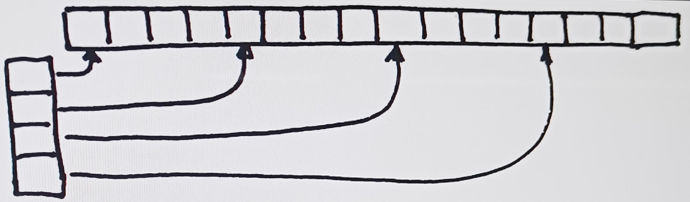
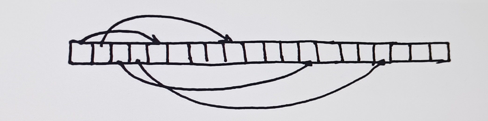

# Code samples

## C
### Sort
* Swap service function
    ```C
    void swapI(int *a, int *b) {
        int tmp = *a;
        *a = *b;
        *b = tmp;
    }
    ```

#### Bubble sort
```C
void sort_bubble(int *a, int n) {
    for (int i = 0; i < n - 1; i++) {
        for (int j = 0; j < n - i - 1; j++) {
            if (a[j] > a[j + 1]) swapI(a + j, a + j + 1);
        }
    }
} 
```

#### Quick sort
```C
void quicksort(int *a, int fs, int ls){
    if(fs<ls){
        int lf=fs, rt=ls, mid=a[((lf+rt)/2)];
        do{
            while(a[lf]<mid)
                lf++;
            while(a[rt]>mid)
                rt++;
            if(lf<=rt){
                swap_I(a+lf,a+rt);
                lf++;
                rt--;
            }    
        }while(lf<=rt);
        quicksort(a,fs,rt);
        quicksort(a, lf, ls);
    }
}
```

#### Heap sort
```C
void heapsort(int *a, int n){
    for (int i = n / 2 - 1; i >= 0; i--)
        heappy(a, n, i);
    for (int i = n - 1; i > 0; i--) {
        swap_I(a, a+i);
        heappy(a, i, 0);
    }
}
void heappy(int* a, int n, int root) {
    int larg = root; 
    int lf = 2 * root + 1;  
    int rt = 2 * root + 2;  

    if (lf < n && a[lf] > a[larg])
        larg = lf;
    if (rt< n && a[rt] > a[larg])
        larg = rt;
        
    if (larg != root) {
        swap_I(a+root, a+larg);
        heappy(a, n, larg);
    }
}
```


### 2-D massive realization
***EXAMPLES***
#### "Array of arrays" (standard)

")

```C
cinst int M=4,N=4;
int count=0;

int ** pionter_array=calloc(M,sizeof(int*));
for (int i=0;i<M;i++)
	pointer_array[i]=malloc(N*sizeof(int));

for (int i=0;i<M;i++)
	for(int j=0;j<N;j++)
		pointer_array[i][j]=count++;

for (int i=0;i<M;i++)
	for(int j=0;j<N;j++)
		printf("%d",pointer_array[i][j]);

for (int i=0;i<M;i++)
	free(pointer_array[i]);
free(pointer_array);
```

#### Array pointing to array



```C
int M=4,N=4;
int count=0;

int ** pointer_array=calloc(M,sizeof(int*));
int* values_array=malloc(M*N*sizeof(int));
for (int i=0;i<M;i++)
    pointer_array[i]=values_array+N*i;

for (int i=0;i<M;i++)
    for(int j=0;j<N;j++)
        pointer_array[i][j]=count++;

for (int i=0;i<M;i++)
	for(int j=0;j<N;j++)
		printf("%d",pointer_array[i][j]); 

free(values_array);
free(pointer_array);
```

#### Single array 



```C
int M=4,N=4;
int count=0;

int single_array_matrix=malloc(M*N*sizeof(int)+M*sizeof(int*));
int* ptr=(int*)(single_array_matrix+M);

for (int i=0;i<M;i++)
    single_array_matrix[i]=ptr+N*i;

for (int i=0;i<M;i++)
    for(int j=0;j<N;j++)
        single_array_matrix[i][j]=count++;

for (int i=0;i<M;i++)
	for(int j=0;j<N;j++)
		printf("%d",pointer_array[i][j]);

free(single_array_matrix);
```

