# Installation of  Ubuntu 20.04 Server LTS

## Block one
1. Downloading Ubuntu 20.04 Server long-term support version [from](https://ubuntu.com/download/server);
2. Downloading && installing [VirtualBox](https://www.virtualbox.org) (or other Virtual Mashine creating program);   
3. 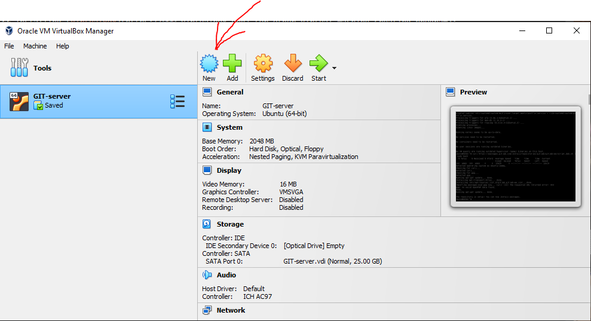
4. Choose the server's new name, choose the folder for your new VM to live in and add ISO image downloaded before:        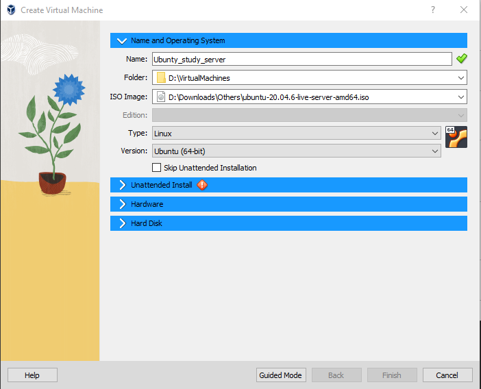
5. Сhoose the ammount of memory and processor's powers you are willing to give to your VM:   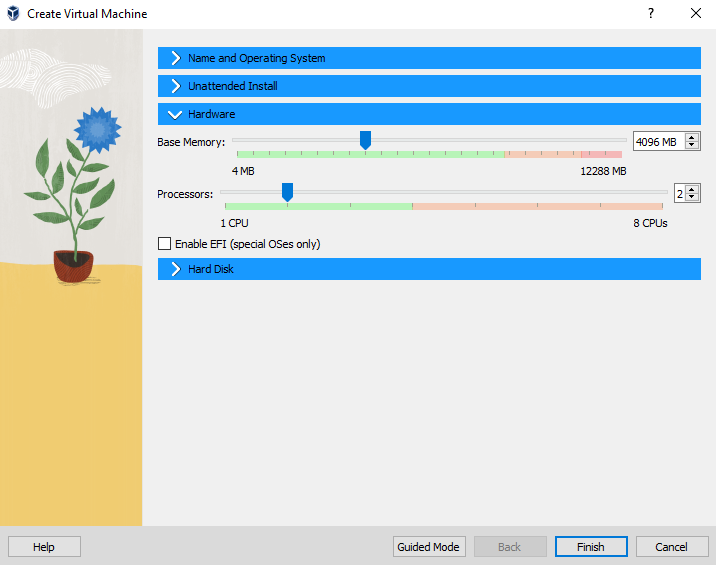
6. Manage virtual HardDrive:     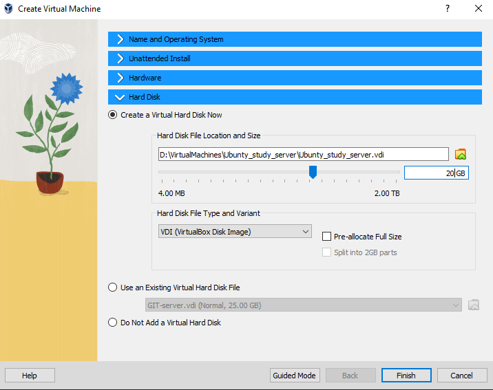
7. Choose your new VM and press "START":     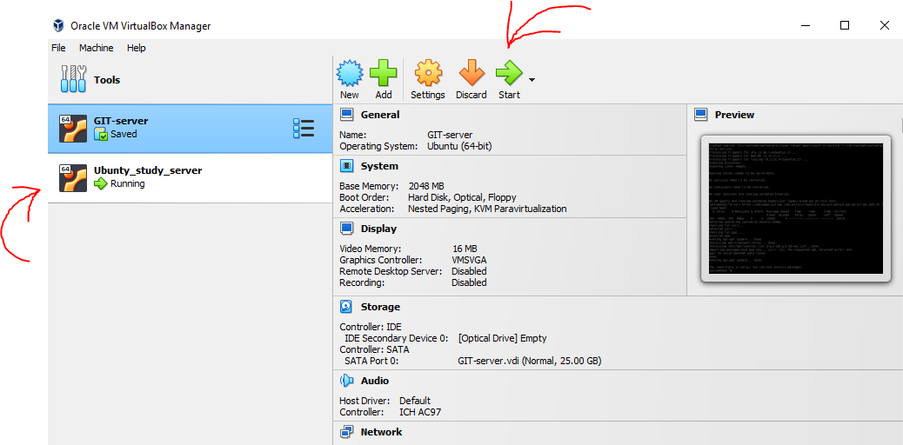

## Block two
8.  Go though all steps of your system installation :
9. 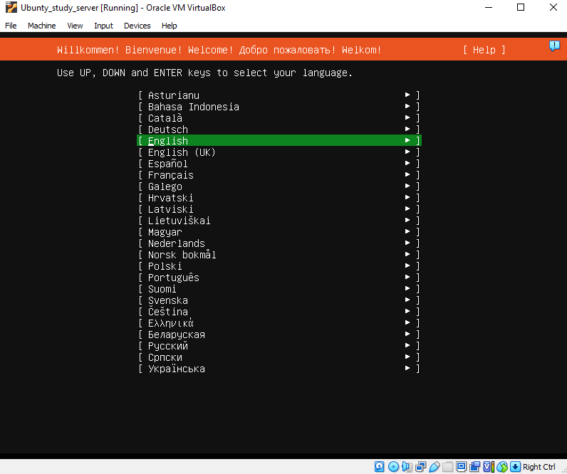     
10. 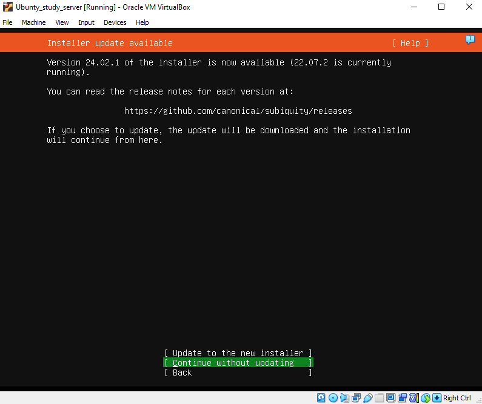      
11. 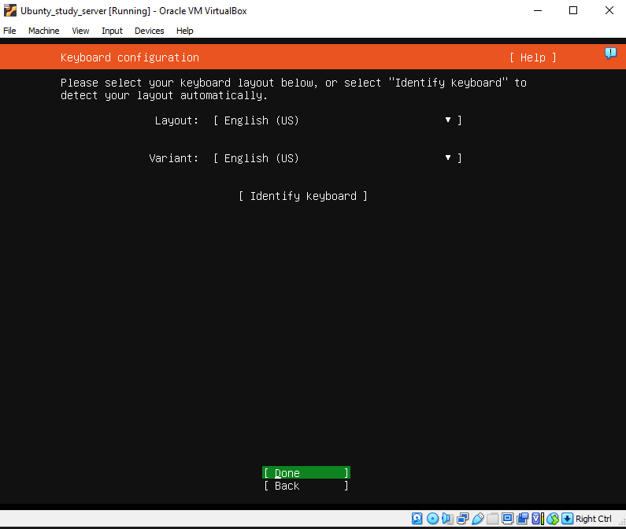      
12. 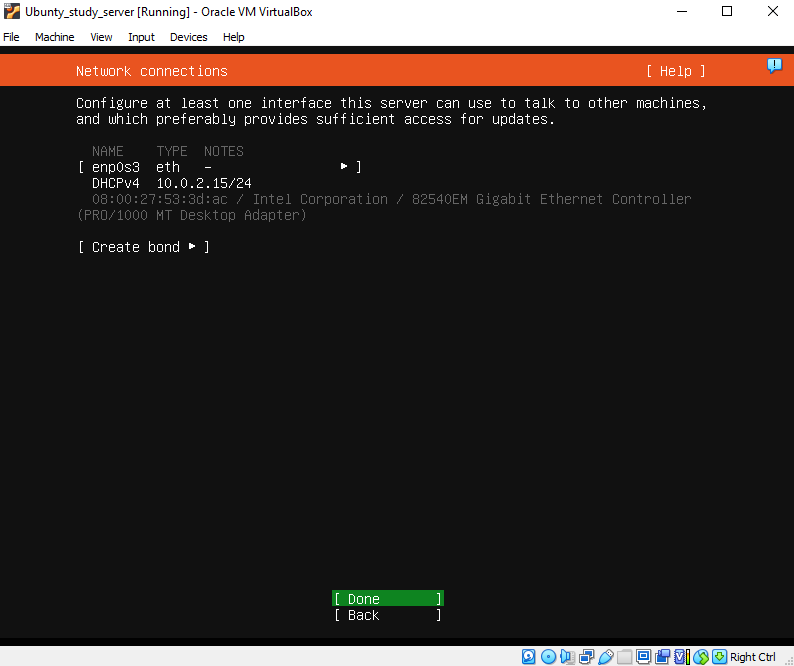      
13. 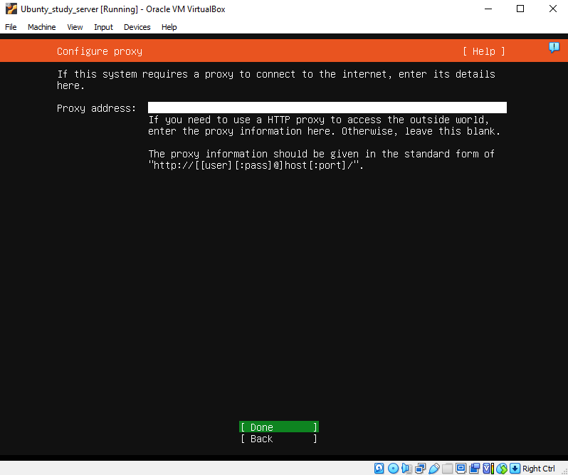      
14. 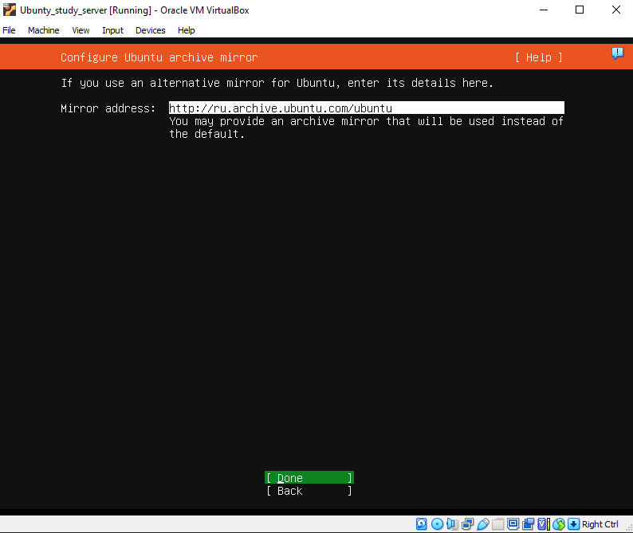      
15. 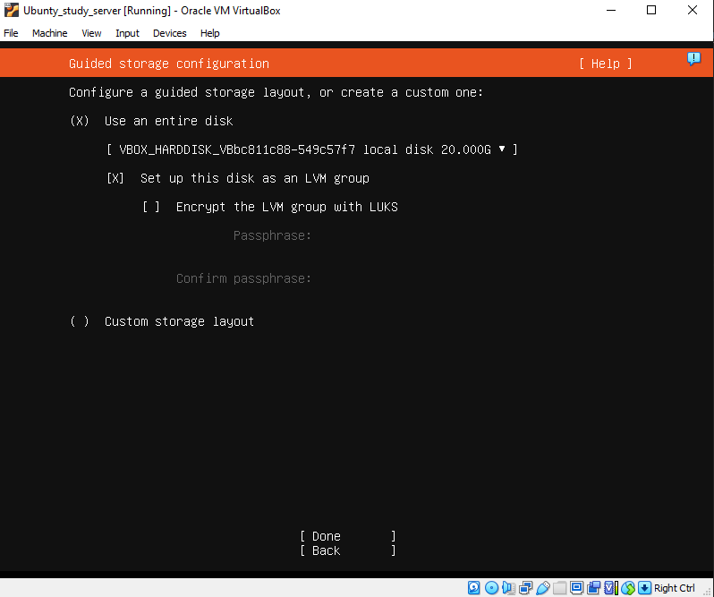    
16. Full file system information of new virtual system:    
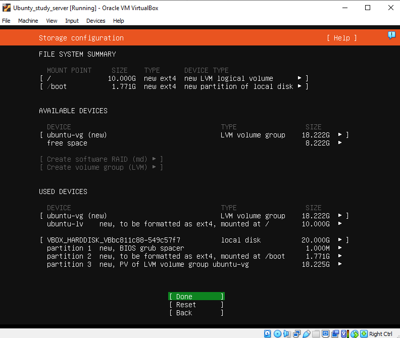    
17. Choose your server's, your name and nick, create a password:    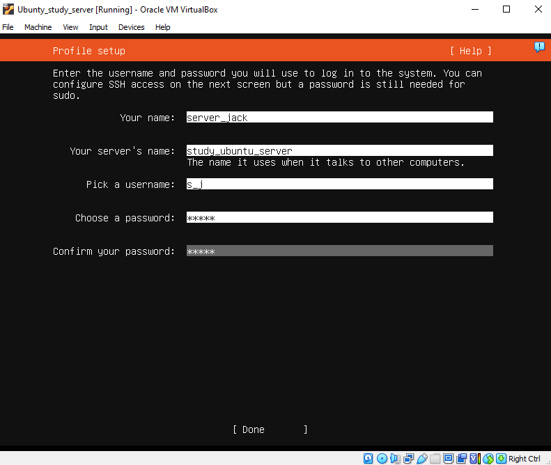      
18. 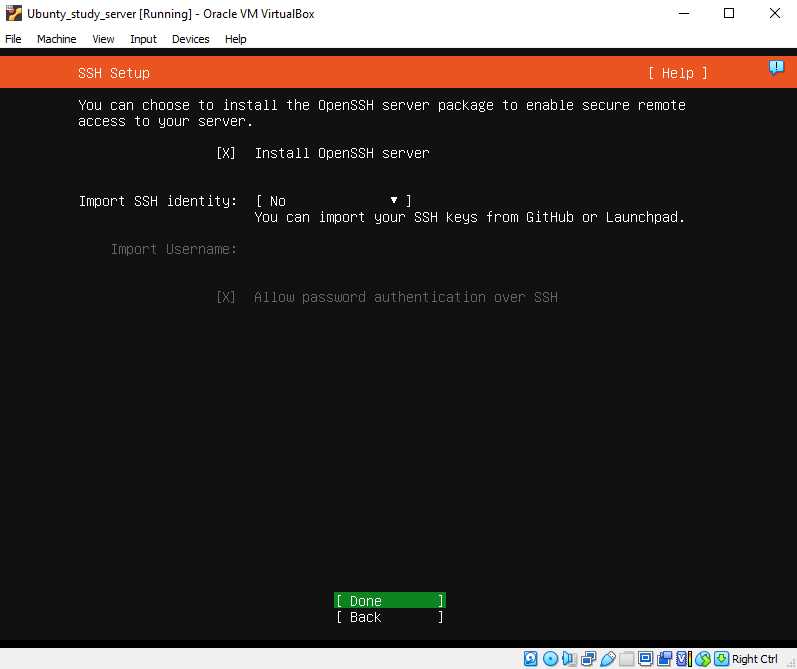      
19. 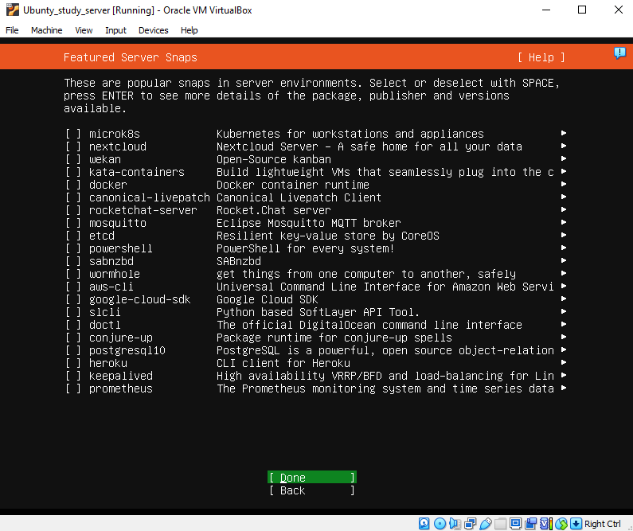      
20. 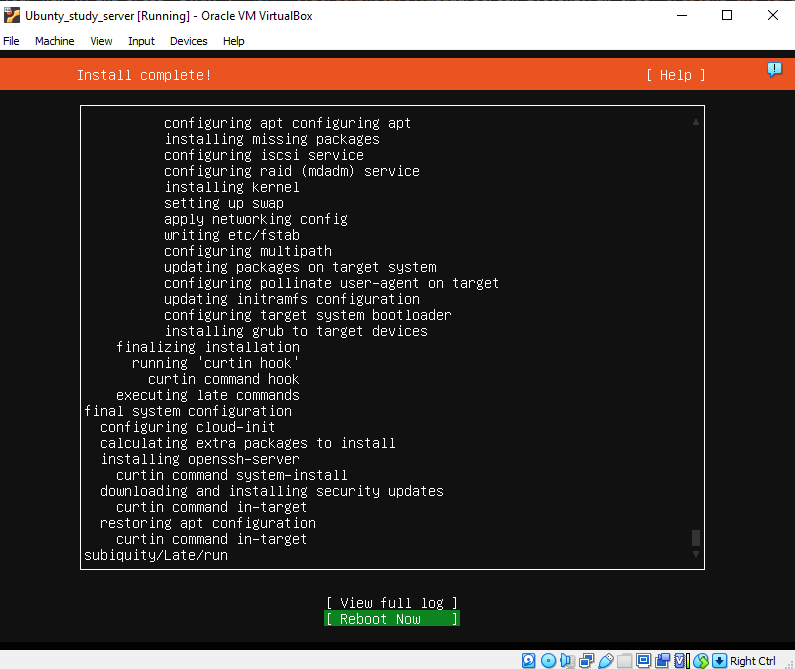      