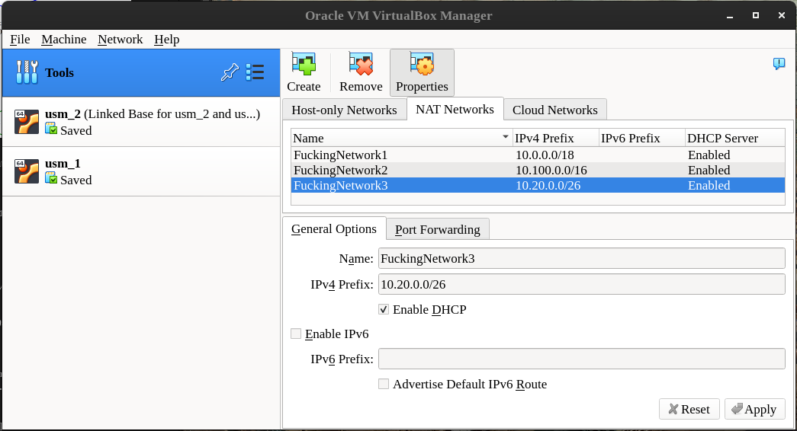
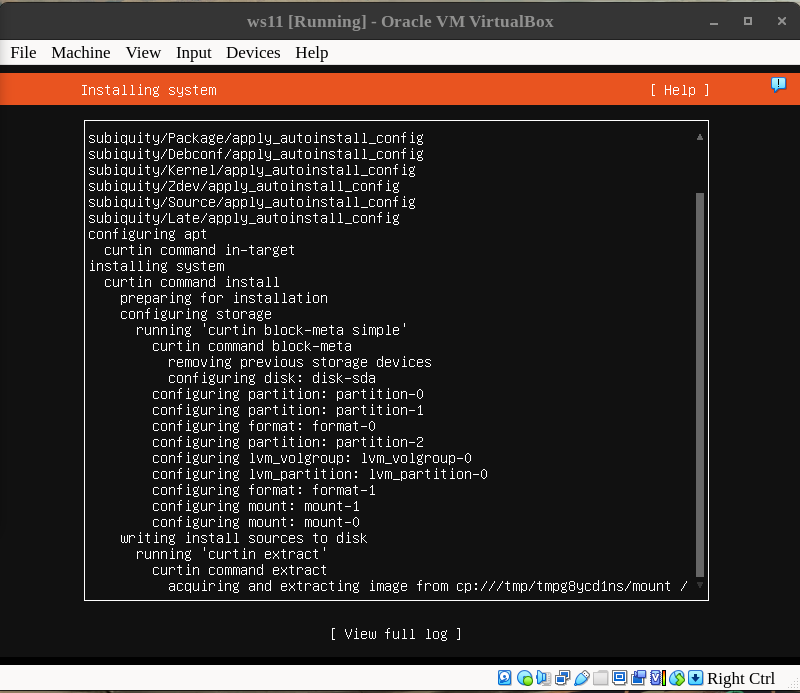
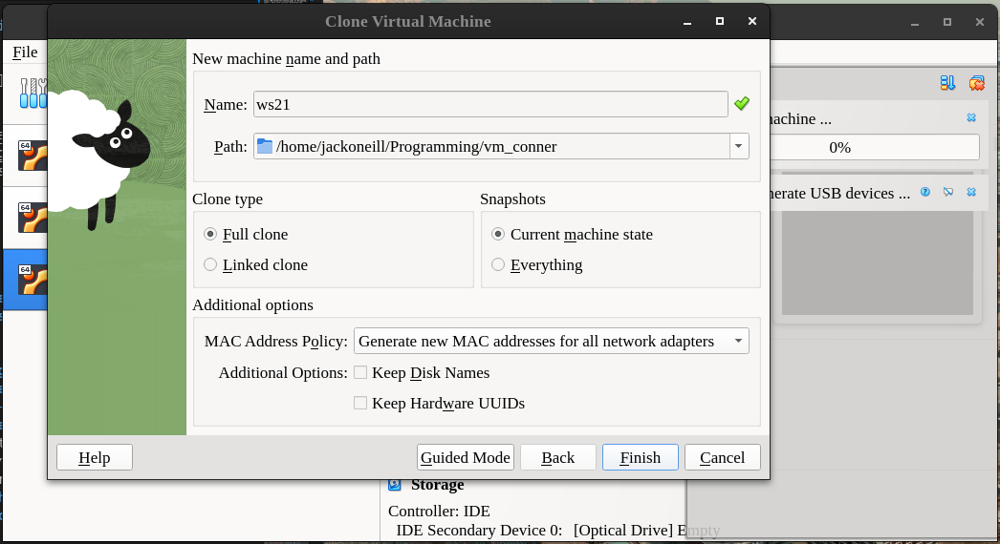
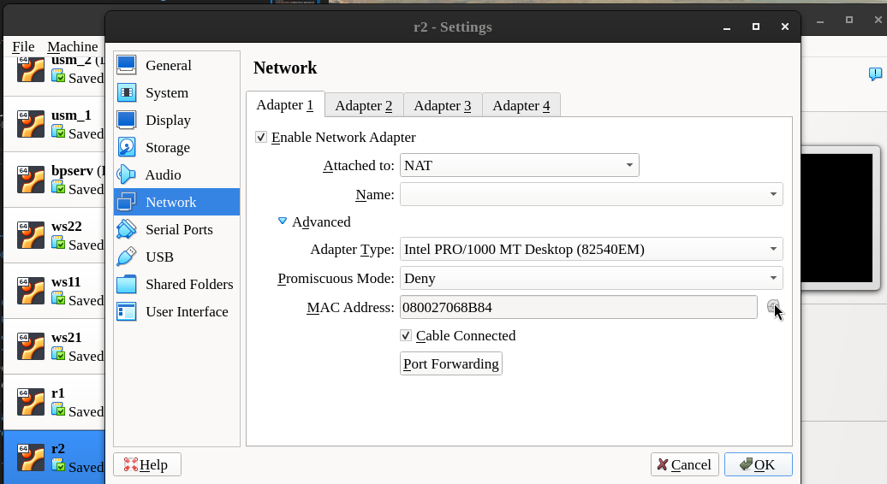
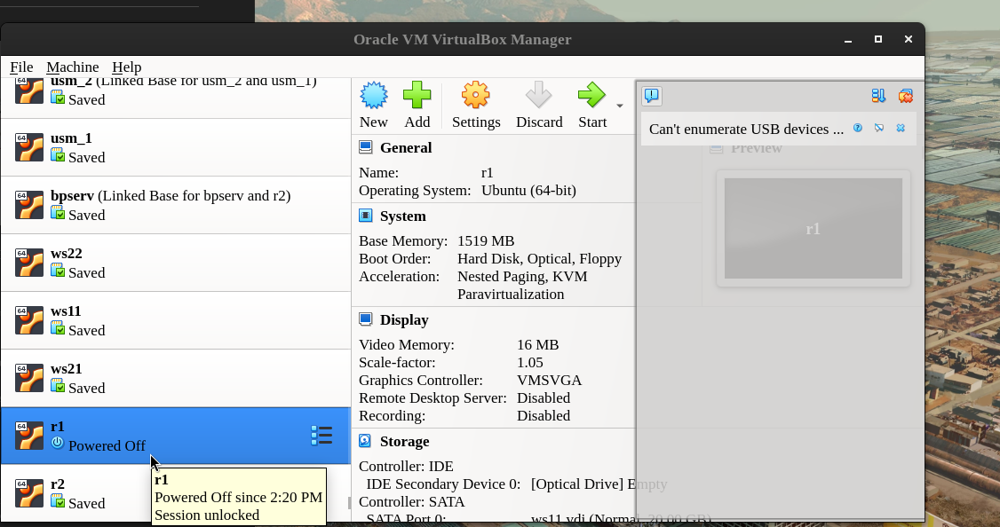
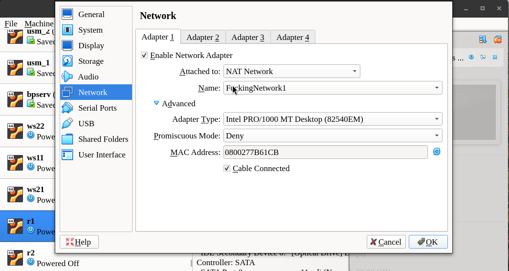
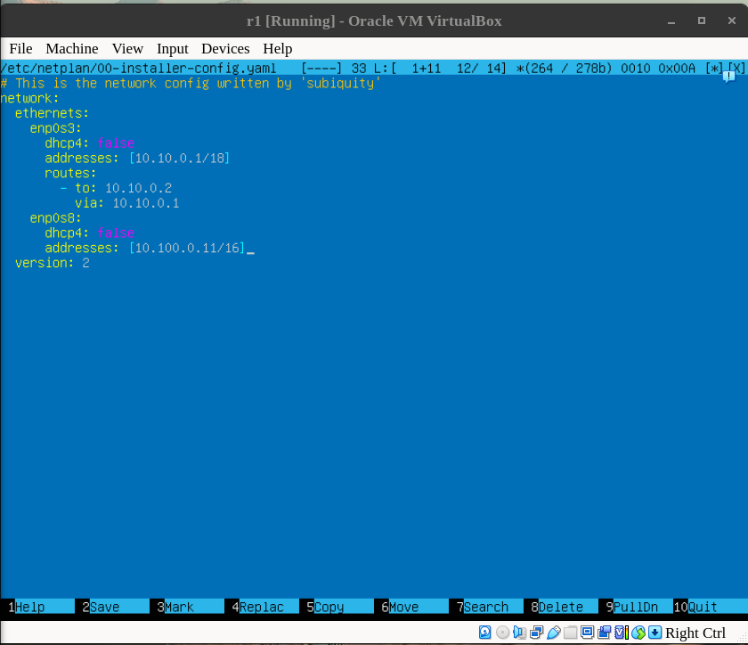

## Contents
1. [Creating needed networks](#1-creating-needed-networks)
2. [Creating virtual machines](#2-creating-virtual-machines)
3. [Setting network connections in VirtalBox](#3-setting-network-connections-in-virtalbox)
4. [Configuring network in the settings of virtual machine](#4-configuring-network-in-the-settings-of-virtual-machine)

* Host-only networks in Oracle VM VirtualBox allow virtual machines to communicate with each other and with the host machine, but not with other networks or the internet. 
* The error message E_ACCESSDENIED (0X80070005) when trying to change host network interface parameters in VirtualBox is likely caused by a new [IP restriction for Host-Only networks introduced in VirtualBox 6.1.28](media/wtf_9.png). This new restriction only allows IP addresses in the 192.168.56.0/21 range to be assigned to host-only adapters.

#### 1. Creating needed networks  



#### 2. Creating virtual machines
 2.1 Create first machine



2.2 Multiply machines by cloning them. Remember that they shout have different MAC addresses!



* linked cloning is faster. 

* MAC address can be changed in settings of the VM.



####  3. Setting network connections in VirtalBox
3.1 Setting machines into *Powered off* state (by starting and stopping those).




3.2 Opening Network Settings of the machine and setting the  adapters.



#### 4. Configuring network in the settings of virtual machine

```
ip a                        #to see the names of connections
sudo netplan --debug generate
ls /etc/netplan/            (ex.00-installer-config.yaml or 01-netcfg.yaml)
sudo nano /etc/netplan/00-installer-config.yaml
sudo netplan apply
ip a                        #to confirm that changies are done
```

**/etc/netplan/00-installer-config.yaml**:



#### 5. Check it with`ping`