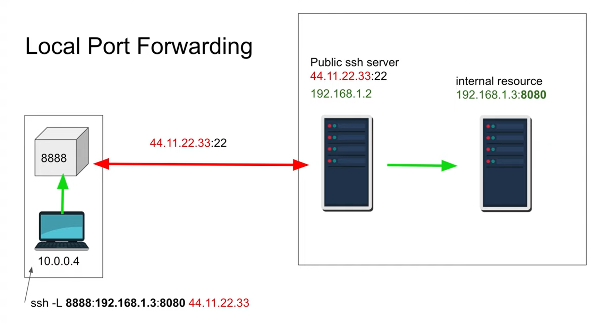
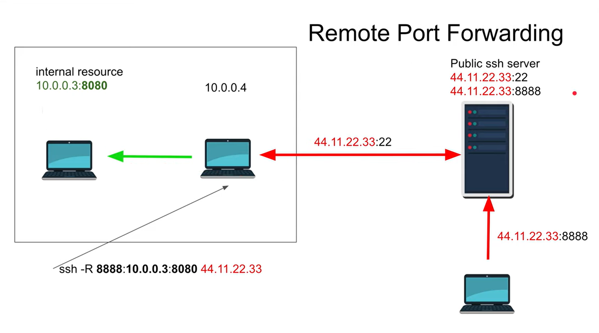

# SSH

* **SSH (Secure Shell)** is a network protocol used for secure remote login and other secure network services over an insecure network. It is a replacement for the older Telnet protocol, which is not secure and transmits data in plain text.
SSH uses strong encryption algorithms to secure the communication between the client and the server, and it provides a number of security features, such as user authentication, data integrity, and confidentiality. It allows users to securely log in to the remote server, execute commands, and transfer files. SSH consists of two main components: the SSH client and the SSH server. The SSH client is installed on the local machine, and it is used to initiate a connection to the SSH server. 

## TCP forwarding 

* [**TCP forwarding**](https://www.youtube.com/watch?v=N8f5zv9UUMI) is a technique used to forward incoming TCP traffic from one network interface or host to another network interface or host. It is commonly used to allow remote access to services that are not directly accessible from the Internet, or to provide secure communication between two hosts over an insecure network. [*TCP forwarding*](https://www.youtube.com/watch?v=Wp7boqm3Xts) can be implemented using a variety of tools and techniques, such as *SSH (Secure Shell)*, N*AT (Network Address Translation)*, and *VPN (Virtual Private Network)*.
    
* **Local TCP forwarding** and **Remote TCP forwarding** are both techniques used in *SSH (Secure Shell)* to forward ports, but they serve different purposes and are used in different scenarios.

    ### Local TCP Forwarding (LPF)
    
    
    * **Local TCP Forwarding (LPF)** is used to forward a port from the client machine to a server. This means that when you connect to a specific port on your local machine, the connection is forwarded to a port on a remote server. You are a user that create a tunnel to a server, so your port will forward info via *SSH* connection to server.
        * It is useful when you need to access a service on a remote server that is not directly accessible from your local machine due to network restrictions or firewall settings.
        * The basic syntax for *LPF* is:
            ```shell
            #ssh -L <local_port>:<remote_host>:<remote_port> <remote_ssh_server_username>@<remote_ssh_server_hostname/ip_address>
            ssh -L local_port:destination_server_ip:remote_port ssh_server_hostname 
            ```
        * For example, if you want to access a web server on a remote server that is not directly accessible, you can use *LPF* to forward a local port to the remote server's web server port 1.

    ### Remote TCP Forwarding (RPF)

    

    * **Remote TCP Forwarding (RPF)** is used to forward a port from the server to the client. This means that when a connection is made to a specific port on the server, the connection is forwarded to a port on your local machine. It is in a certain way an opposite to the *LPF*. You are not a user, you are a server, that reroute the packages from your internal server to some public server/machine.
        * It is useful for providing access to services running on your local machine to remote users. For instance, if you want to allow a remote user to access a service running on your local machine, you can use *RPF*.
        * The basic syntax for *RPF* is: 
            ```shell
            #ssh -R <remote_host_IP><remote_port>:<local_host_IP>:<local_port> <remote_ssh_server_username>@<remote_ssh_server_hostname/ip_address>
            ssh -R remote_ip:remote_port:local_ip:local_port user_name@ssh_server_hostname.
            ```
        * For example, if you want to allow a friend to access your remote desktop, you can use *RPF* to forward a port on the remote server to your local machine's desktop port 1.


## Enter any machine in local network as a user.

1. Activate *SSH-server* at the remote device (**m1**).
2. Activate *SSH-client* on your second device (**m2**).
3. `ping` *m1* from *m2* to check that there is a connection.
4. Check the *firewall* rules to see if the connection is not prohibited at the certain port (`sudo iptables -L -v`).
5. Check that SSH-server is active:
```
sudo systemctl status ssh
```
6. On *machine #2* run the following command and answer *"yes"* when asked if you trust the server and enter the password of the chosen user.
```
ssh <username a user from m1>@<IP address of m1>
```
7. Congrats, you can use the *machine #1* remotely!