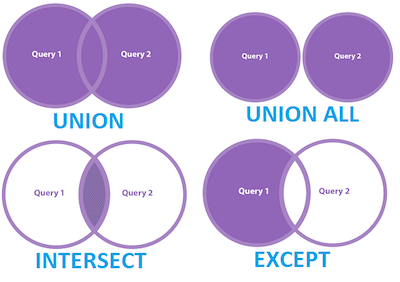
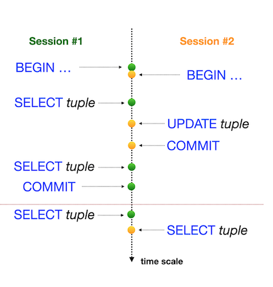

# PostgreSQL 101 (psql ver. 2.0)

### Contents:

0. [File description](#file-description)
1. [Theory](#theory)
    1.1. [Terms](#terms) \
    1.2. [Anomalies](#anomalies)
2. [instalation](#instalationgeneral)
3. [Entering DB shell](#entering-database-shell)
4. [Creating user](#creating-a-user)
5. [Creating DB](#creating-database)
6. [Connect to DB](#connect-to-database)
7. [DB shell command list](#database-shell-commands-list)
8. [SQL commands list](#sql-commands-and-functions-list)
9. [Data types](#data-types)
10. [Constraints](#constraints) \
    10.1. [Primary key](#primary-key) \
    10.2. [Unique constraint](#unique-constraint) \
    10.3. [Check constraint](#check-constraint) 
11. [Tables connection](#tables-connection) \
    11.1. [Foreign key](#foreign-key-relationship) \
    11.2. [Joins](#joins) \
        11.2.1. [Join](#join) \
        11.2.2. [Left join](#left-join) \
        11.2.3 [Cross join](#cross-join) \
        11.2.4. [Natural join](#natural-join) \
        11.2.5. [Full join](#full-join)\
    11.3. [Set operations](#set-operations) \
        11.3.1. [UNION](#union) \
        11.3.2. [INTERSECT](#intersect) \
        11.3.3. [EXCEPT](#except)
12. [Sequence](#sequence)
13. [Common Table Expression (CTE)](#common-table-expression-cte)
14. [Recursive queries](#recursive-queries)
15. [View](#view)
16. [Index](#index)
17. [Comments](#comments)
18. [Transactions](#transactions)
19. [Functions] (#functions)
1. [Extensions](#extensions)
. [Examples](#examples) \
    18.1. [Create table](#create-table-no-constrains)\
    18.2. [Create table](#create-table-with-constrains)\
    18.3. [Insert values into table](#insert-values-into-table)\
    18.4. [Sorted output](#sorted-output) \
    18.5. [Unique output](#unique-output) \
    18.6. [Selective output](#selective-output) \
    18.7. [Summarizing result](#summarizing-result) \
    18.8. [Use of functions](#use-of-functions) \
    18.9. [Simple calculations](#simple-calculations) \
    18.10. [Table calculations](#table-calculations) \
    18.11. [Null handling](#null-handling) \
    18.12. [Timestamp](#timestamp) \
    18.13. [Structure changes](#structure-changes) \
    18.14. [Data changes](#data-changes) \
    18.15. [Conflict handler](#conflict-handler) \
    18.16. [Formated output](#formated-output)\
    18.17. [Case(if-else)](#if----else-aka-case) \
    18.18. [Generate series](#generate-series) \
    18.19. [Greatest && Least](#greatest--least) \
    18.20. [Alter](#alter) \
    18.21. [If exists](#if-exists) 
. [Export data](#export-data) \
    19.1. [CSV](#csv)
. [Links](#links)

## File description

* Foulder [table_examples](table_examples) contain some *SQL* files that can be inported into DB, those are used as examples in text below.
    |File|Description|Tables|
    |----|-----------|---|
    | [car.sql](table_examples/car.sql)|BD full of car info|car|
    | [person.sql](table_examples/person.sql)|BD full of personal info|person|
    | [connected_1.sql](table_examples/connected_1.sql)|BD made partly from *car* and *person*|car<br>person|
    | [connected_uuid.sql](table_examples/connected_uuid.sql)|same as the one before, but **id** is *UUID*|car<br>person|
    | [connected_2.sql](table_examples/connected_2.sql)|BD contains pizzeria associated [info](DICM/th_3.png)|pizzeria<br>person<br>person_order<br>person_visits<br>menu|

* *DICM* foulder countains illustrations for the file. 


## Theory
### Terms
|Term|Def|
|---|---|
|**(SQL) Structured Query Language**|the database language by which we can perform certain operations on the existing database, and we can also use this language to create a database.|
|**DDL (Data Definition Language)**|consists of the SQL commands that can be used to define the database schema, deals with descriptions of the database schema and is used to create and modify the structure of database objects in the database (**CREATE**, **DROP**, **ALTER**, **TRUNCATE**, **COMMENT**, **RENAME**).|
|**DML (Data Manipulation Language)**|refers to SQL statements that are used to manage and manipulate data in a database: **INSERT**, **UPDATE**, **DELETE**, **LOCK**, **CALL**, **EXPLAIN PLAN**.<br> These commands modify the data within the database without altering the structure of the tables.|
|**DQL (Data Query Language)**|performs queries on the data within schema objectsts to get some schema relation based on the query passed to it, allows getting data from the database and imposing order upon it (**SELECT**).|
|**DCL (Data Control Language)**|includes commands such as **GRANT** and **REVOKE** which mainly deal with the rights, permissions, and other controls of the database system. |
|**TCL (Transaction Control Language)**|transactions group a set of tasks into a single execution unit, each transaction begins with a specific task and ends when all the tasks in the group are successfully completed, if any of the tasks fail, the transaction fails (**BEGIN TRANSACTION**, **COMMIT**, **ROLLBACK**, **SAVEPOINT**).|
|[**Set operations**](#set-operations)|**UNION**, **INTERSECT**, **EXCEPT**.|
|[**CTE**](#common-table-expression-cte)|Common Table Expression (**WITH** ... **AS (**...**)**).|
|**BIGSERIAL** |spesial data type that is *BIGINT* and has auto incrimination function.|
|[**primary key**](#primary-key)| Value that uniquely identify a record in the table (unique for any and all rows, not NULL).|
|[**UNIQUE** constraint](#unique-constraint)|Value that must bw unique for every row, but can be NULL. the constraint would not allow to add a new row with the similar to some other data in the constraint column.|
|[**CHECK** constraint](#check-constraint)|Allow to list values the particular column can have or a rule values must follow (ex. price>0), will not allow to set a value to the column that is against the rule.|
|[**foreign key**](#foreign-key-relationship)|Unique value that reference *primary key* from another table (!!types of foreign key column and primary key from another table column must be same!!).|
|[**join**](#join)|Return the data that is common in several tables. If you have *foreign key* that is present in several tables it connects those and data in them, *Join* will output only that data.|
|[**left join**](#left-join)|Return the data that is common in several tables + all data from first table. If you have *foreign key* that is present in several tables it connects those and data in them, *left join* will output  that data and all other data from the first table.|
|[**cross join**](#cross-join)|*CROSS JOIN* allow to output all possible combinations of two tables in SQL.|
|[**NATURAL JOIN**](#natural-join)|A *NATURAL JOIN* in *SQL* is a type of join that automatically combines two tables based on columns with the same names and compatible data types. It simplifies the process by eliminating the need to explicitly specify the join condition. However, it can be risky because it relies entirely on column names, which may unintentionally match columns you don’t want to join.|
|[**FULL JOIN**](#full-join) <br>(or **FULL OUTER JOIN**)|is used to combine rows from two tables, returning all rows from both tables, regardless of whether there is a match between them. If a row from one table doesn't have a match in the other table, the result will include that row with NULL values for the columns from the other table.|
|[**Sequence**](#sequence)|set of autoincrease numbers,  autocreated  with setting of *SERIAL* and *BIGSERIAL* data tipes.|
|["**INSERT-SELECT**"](#insert-values-into-table) pattern|allows to insert data into a table by selecting values from another table or query result.|
|[**VIEW**](#view)|a virtual table based on the result set of a `SELECT` query that does not store data itselfe, instead, it presents data derived from one or more tables.|
|[**MATHERIALIZED VIEW**](#materialized-view)|a database object that stores the result of a query **physically on disk**, rather than just being a virtual table like a regular view (can significantly improve query performance, especially for complex queries or large datasets due to it's saved nature).|
|[**INDEX**](#index)|a database object used to speed up the retrieval of rows by creating an additional data structure, improves the performance of **SELECT** queries by allowing the database to quickly locate the rows without having to scan the entire table.|
|[**TRANSACTION**](#transactions)|Transactions group a set of tasks into a single execution unit. Allow several people to work with DB at the same time and deal with anomalies.|
|[**Anomalies**](#anomalies)|Anomalies in the relational model refer to inconsistencies or errors that can arise when working with relational databases, specifically in the context of data insertion, deletion, and modification. |

### [Anomalies](#theory)

Database theory has 4 foundametal data anomalies (physical anomalies):
* Lost Update Anomaly;
* Dirty Reads Anomaly;
* Non-repeatable Reads Anomaly;
* Phantom Read Anomaly.

Therefore, there are different [isolation levels](#transaction-isolation-levels) in ANSI SQL standard that prevent known anomalies.


From one point of view, this matrix should be a standard for any Relational Database, but reality... looks a bit different.
||| |
| --- | --- | --- |
| PostgreSQL |  |
| Oracle |  |
| MySQL |  |

Nowadays, IT community found a set of new anomalies based on Database Model (logical view):
- Read Skew Anomaly;
- Write Skew Anomaly;
- Serialization Anomaly;
- Fan Traps Anomaly;
- Chasm Traps Anomaly;
- Data Model Loops Anomaly;
- etc.

The most common way to illustrate anomalies is to use several [transactions](#transactions) at the same time with different isolation levels.

* [off top] Remember! The [Curve of Usefulness](DICM/th_9.png) of detailed data over time decrease but the value of aggregated data increase.

## Pre_Work

#### [Instalation.general](https://www.postgresql.org/download/)
#### [Instalation.fedora](https://developer.fedoraproject.org/tech/database/postgresql/about.html)

### !

* In Windows use **SQL Shell** or **pqAdmin**.
* In Linux use *terminal* enter user **postgres** (```sudo su - postgres```) or your own user with sertain database, or use **pqAdmin**.


## Entering database shell
### Linux 1
1. Linux -> *terminal* -> user **postgres**;
2. ```psql```.

### Linux 2 (for sertain DB)
1. ```psql -h <address> -U <user> -p <gate> <db_name> ```.

### Windows
1. Use **SQL Shell** app.


## Creating a user
### DB Shell
1. Enter database shell;
2. ```CREATE USER <db_username> WITH PASSWORD '<password>';```.
### Linux
1. Linux -> *terminal* -> user **postgres**;
2. ```createuser -P <db_username>```.


## Creating database
### DB Shell
1. Enter database shell;
2. 
    ```SQL
    CREATE DATABASE <db_name> WITH OWNER <db_username> ENCODING='UTF8' LC_COLLATE='en_GB.UTF-8' LC_CTYPE='en_GB.UTF-8';
    --or
    CREATE DATABASE <db_name> WITH OWNER <db_username> ENCODING='UTF8' LC_COLLATE='en_US.utf8' LC_CTYPE='en_US.utf8';
    --or
    CREATE DATABASE <db_name>
    ```
```
ex.:
CREATE DATABASE temp_db WITH OWNER jackoneill ENCODING='UTF8' LC_COLLATE='en_GB.UTF-8' LC_CTYPE='en_GB.UTF-8';
```
### Linux
1. Linux -> *terminal* -> user **postgres**;
2. ```createdb <db_name> -O <db_username>```.


## Connect to database
### linux
1. Linux -> *terminal* -> user **postgres**;
2. ```psql -h <DB_address> -U <db_username> <db_name>```.
```
ex.:
psql -h localhost -U jackoneill -p 5432  temp_db
```

### DB Shell
1. Enter database shell;
2. ```\c <db_name>```


## Database shell commands list
|Command| Explanation |
|---|---|
|\q|exit|
|\l|list databases|
|\\?|PSQL commands help|
|help|general db shell cammands help|
|\h| SQL commands help|
|\d| show list of tables amd sequences in DB|
|\dt| show only list of tables  in DB|
|\d <table_name>| show table info|
|\i <file_name>|execute commands from file (be careful: windows -' \\', linux && psql -' / '!) |
|\x|change to another data interpritation (allow to show big tables better) <br> - aka. change colomns into rows in output|

## SQL+ commands and functions list 

* All SQL command lines end with **';'**!
* *NULL* handling:[📗](#null-handling).
* SQL comparison opperators(**>**,**<**,**>=**,**<=**,**=**,**<>**) can be used on numbers, lines, dates etc.
* "**%**" - any character(s); "**_**" - any *single* character.
* For data analyses can be used [aggregate functions](https://www.postgresql.org/docs/16/functions-aggregate.html) (*COUNT*, [etc](#use-of-functions)).
* Calculation examples:[📙](#simple-calculations)[📘](#table-calculations).

|Tag list|||||
|---|---|---|---|---|
|**command**;<br> **function**;|create;<br> delete; <br>change_table (structure_change); <br>data_change;|output_data;<br> filter (search); <br>sort; <br>limit; <br>data_analyses; |gen_data; <br>error; <br>table_connection|get_info <br> way_of_work|


|Command| Explanation |Tag|
|---|---|---|
|**CREATE DATABASE** <db_name>; |create DB |create<br>structure_change<br>command|
|**DROP DATABASE** <db_name>; |delete DB|delete<br>structure_change<br>command|
|**CREATE TABLE** <table_name> ( <br> <colunm_1 name> <[data type](https://www.postgresql.org/docs/16/datatype.html)> \<Constrains, if there are any> <br> <colunm_2 name> <[data type](https://www.postgresql.org/docs/16/datatype.html)><br>);|[create table](#create-table-no-constrains)|create<br>structure_change<br>command|
|**DROP TABLE** <table_name>; |delete table|delete<br>structure_change<br>command|
|**INSERT INTO** <table_name> (<list_of_columns>) <br> **VALUES** (<list_of_values>);|insert records|data_change<br>command|
|**INSERT INTO** <table_name> (<list_of_columns>) <br> **SELECT** <columns_made_with_select>;|[insert records](#insert-values-into-table)|data_change<br>command|
|**SELECT * FROM** <table_name>|print the table (instead of "*" can be *name_of_columns* to return this columns)|output_data<br>command|
|**DISTINCT**|goes after select to [remove](#unique-output) dublicates|output_data<br>filter<br>command|
|**ORDER BY** <column_name>|goes after <table_name> to order the output|sort<br>output_data<br>command|
|SELECT * FROM <table_name> **WHERE** <column_name>='<data_example>' **AND/OR** <other_condition>|[selective output](#selective-output) be like (constructions may be more complex and use "()")|filter<br>output_data<br>command|
|SELECT * FROM <table_name> WHERE <column_name> **IN** **(**<data_example_1>, <data_example_2>, ..**)**|[selective output](#selective-output) with several values ​​of interest (can be inverted with **NOT**)|filter<br>output_data<br>command|
|SELECT * FROM <table_name> WHERE <column_name> **EXISTS** **(**  **)**| [**EXISTS**](#selective-output)  keyword in *SQL* is a logical operator used in **WHERE** clauses to check the existence of rows returned by a subquery(!!). It returns *TRUE* if the subquery finds at least one row and *FALSE* if no rows are found(can be inverted with **NOT**)|filter<br>output_data<br>command|
|SELECT * FROM <table_name> WHERE <column_name> **BETWEEN** <data_example_begining> **AND** <data_example_END>|[selective output](#selective-output) with the range of values ​​of interest|filter<br>output_data<br>command|
|SELECT * FROM <table_name> WHERE <column_name> **LIKE** '<data_pattern>'|[selective output](#selective-output) based on similar pattern in the values of interest|filter<br>output_data<br>command|
|**ILIKE** '<data_pattern>'|similar to **LIKE** but is not case sensitive |filter<br>output_data<br>command|
|**LIMIT** \<number>|put at the end of the command to limit the number of rows in output|limit<br>output_data<br>command|
|**OFFSET** \<number> |put at the end of the command *but* before **LIMIT** to exclude first <number> rows from output |limit<br>output_data<br>command|
|**FETCH FIRST** \<number> **ROW ONLY**;| same as **LIMIT**|limit<br>output_data<br>command|
|**GROUP BY** <column_name>|[used](#summarizing-result) after the *<table_name>* to group/summarize identical data from the column |output_data<br>filter<br>data_analyses<br>command|
|**COUNT(**\<argument(<column_name>/*/etc)>**)**|function (will appear as a column) [used](#summarizing-result) to summerize unique data from <argument> based on **GROUP BY** column data|output_data<br>data_analyses<br>function|
|GROUP BY <column_name>**HAVING** <rule>|must be [used](#summarizing-result) with **GROUP BY** and take place right after it, can specify (filter) the output |output_data<br>filter<br>command|
|<column>**AS**<new_column_name>|(aka. Alias) allow you to set a [name or rename](#table-calculations) any column in output|output_data<br>command|
|- **COALESCE(**<column_name>**)**<br>- **COALESCE(**<column_name>, '<replacement_of_NULL>**)**|- return the column but remove *NULL* values from the begining of the column (until frirst not *NULL*)<br>- return the column and [replace](#null-handling) all the *NULL* values with the *<replacement_of_NULL>*|output_data<br>filter<br>data_analyses<br>function|
|**NULLIF(**<value_1>,<value_2>**)**|[return](#null-handling) *<value_1>* if *<value_1>*!=*<value_2>* and *NULL* if *<value_1>*==*<value_2>* |data_analyses<br>function|
|**NOW()**|returns [timestamp](#timestamp):"YYYY-MM-DD HH:MM:SS.MILSEC+TimeZone|gen_data<br>function|
|NOW() +/- **INTERVAL** '<the_interval>|[used](#timestamp) for time calclations|gen_data<br>data_analyses|
|**EXTRACT(**<the_part_of_data> **FROM** NOW()**)**|[used](#timestamp) to get the particular part of timestamp|filter<br>data_analyses<br>function|
|**AGE(**<time_to>,<time_from>**)**|[calculate](#timestamp) the age (aka. time difference)|data_analyses<br>function|
|**DELETE** FROM <table_name> WHERE <rule>|[deleting](#data-changes) rows from table based on it's parameters (aka. *<rule>*)|data_change<br>command|
|**ALTER** TABLE <table_name> <the_change>|[used](#alter) to modify the structure of an existing table, column or view.|change_table<br>structure_change<br>command|
|ALTER TABLE <table_name> **ADD** <adding_changes>|command used to [add structure changes](#structure-changes) to the table|change_table<br>structure_change<br>command|
|ALTER TABLE <table_name> ADD **CONSTRAINT** <constraint_name> <constraint_itself>|command used to add a [new constraint](#unique-constraint)  to the table|change_table<br>structure_change<br>command|
|**UPDATE** <table_name> **SET** <column_name>='<new_data>' WHERE <rule>|[updating](#data-changes) rows selected by the *<rule>* with the *<new_data>* to the *<column_name>*|data_change<br>command|
|**ON CONFLICT** <column_name>/<other_conflict_case> **DO** <command_to_perform_in_case_of_conflict>|handling [conflict](#conflict-handler) situations, can be used only with *<column_name>* that is either a *primal key* or a *unique constraint* |data_change<br>error<br>command|
|ON CONFLICT <column_name>/<other_conflict_case> DO **NOTHING**|allow to handle [conflict](#conflict-handler) with doing nothing|data_change<br>error<br>command|
|ON CONFLICT <column_name>/<other_conflict_case> DO UPDATE set <column_name_to_replace>=**EXCLUDED.**<column_name_new_info>|in case of a [conflict](#conflict-handler) replace existing info with new one for given columns otherwise add a new row|data_change<br>error<br>command|
|<column_name> <data_type> **REFERENCES** <other_table_name>(<column_of_the_table>)|parameter of the colunm to [create](#foreign-key-relationship) [connected](#terms) to another table column|create<br>table_connection<br>command|
|SELECT <columns_names> FROM <table_1_name> **JOIN** <table_2_name> **ON** <table_1_name>.<foreign_key_column_t1> = <table_2_name>.<foreign_key_column_t2>|allow to [output](#join) the [connected](#terms) data from tables (**!**will output only rows that have data in both/all tables)|output_data<br>table_connection<br>filter<br>command|
|SELECT <columns_names> FROM <table_1_name> **LEFT JOIN** <table_2_name> **ON** <table_1_name>.<foreign_key_column_t1> = <table_2_name>.<foreign_key_column_t2>|allow to [output](#left-join) the [connected](#terms) data from tables (**!**will output rows that have data in both/all tables and other rows from the first table)|output_data<br>table_connection<br>filter<br>command|
|**CASCADE**| added to the end after deletion allow to delete ad the dependences and foreign keys (**!** is a dangerous practice) |change_table<br>data_change<br>command|
|**nextval('**<sequence_name>**'::regclass)**;|+1 for *last_value* of the [sequence](#sequence)|data_change<br>gen_data|
|SELECT <columns_names> FROM <table_1_name> JOIN/LEFT JOIN <table_2_name> **USING** <column_name_that_is_identical_in_both_tables>|[simplefy](#example-of-using-extensions-in-work-uuid) *JOIN* and *LEFT JOIN* in case connected columns have same name|output_data<br>table_connection<br>filter<br>function|
|<column_name> **default** <default_data>| [add default data](#create-table-with-constrains) to the table's column settings|change_table<br>data_change<br>command|
|ALTER TABLE <table_name> ALTER COLUMN <column_name> <br> **SET DEFAULT** <default_value;>| set default value to existing column|change_table<br>data_change<br>command|
|**EXCEPT**|[Set operations](#set-operations)|output_data<br>table_connection<br>filter<br>command|
|**INTERSECT**|[Set operations](#set-operations)|output_data<br>table_connection<br>filter<br>command|
|**UNION**|[Set operations](#set-operations)|output_data<br>table_connection<br>filter<br>command|
|[**CROSS JOIN**](#cross-join)|[cross join](#terms)|output_data<br>table_connection<br>filter<br>command|
|[**NATURAL JOIN**](#natural-join)|[natural join](#terms)|output_data<br>table_connection<br>filter<br>command|
|[**FULL JOIN**](#full-join)|[full join](#terms)|output_data<br>table_connection<br>filter<br>command|
|**generate_series(** start, stop, step **)**|[**generate_series**](#generate-series) is a set-returning function in PostgreSQL that generates a series of values based on a specified *start*(the starting value of the series), *stop*(the ending value of the series), and *step*(the increment value between each element in the series). (It can be used for creating a sequence of numbers, dates, or timestamps.)|gen_data<br>function|
|**LEAST(**<list_of_values>/<list_of_columns>**)**<br>**GREATEST(**<list_of_values>/<list_of_columns>**)**|[Return](#greatest--least) smallest (inc. alphabetically first) or biggest values|output_data<br>filter<br>data_analyses<br>function|
|**MAX(**<column_name>**)**|return the biggest value from the column (similar [works](#use-of-functions) with **MIN(**...**)**)|output_data<br>filter<br>data_analyses<br>function|
|**FLOOR(**\<value>**)**|floor function|gen_data<br>data_change<br>function|
|**CREATE VIEW** <view_name> <selection><br>**REPLACE VIEW**<view_name> <selection><br>**DROP VIEW**<view_name> |used to [create / update / delete](#view) a [**view**](#theory)|create<br>filter<br>output_data<br>delete<br>command|
|CREATE **MATERIALIZED** VIEW <view_name> <selection><br>REPLACE **MATERIALIZED** VIEW<view_name> <selection><br>DROP **MATERIALIZED** VIEW <view_name> **REFRESH MATERIALIZED** VIEW <view_name>|used to [create / update / delete / refresh](#view) a **materialized** [**view**](#theory)|create<br>filter<br>output_data<br>delete<br>structure_change<br>command|
|**ROUND(**\<data>**)**|round the data ad bring it to INTEGER|data_change<br>output_data<br>gen_data<br>function|
|ORDER BY **RANDOM()**|In PostgreSQL, you can use the **RANDOM()** function to order the rows randomly.|output_data<br>sort<br>function|
|WITH **RECURSIVE** <recursion_CTE_name> AS (<CTE>) |to [use](#recursive-queries) recursive [Common Table Expression](#common-table-expression-cte) |output_data<br>data_analyses<br>gen_data<br>command|
|**CREATE INDEX** <index_name> **ON** <table_name> (<column_name>) <br> **DROP INDEX** <index_name> |to [create / delete](#index) an index|create<br>filter<br>output_data<br>delete<br>command|
|**CREATE UNIQUE INDEX** <index_name> **ON** <table_name> (<column_name>) <br> **DROP UNIQUE INDEX** <index_name> |to [create / delete](#unique-index) an ***unique*** index|create<br>filter<br>output_data<br>delete<br>command|
|**CREATE UNIQUE INDEX** <index_name> **ON** <table_name> (<column_name>) **WHERE** <condition_for_unique_rows>|to [create](#partial-unique-index) an ***partially unique*** index|create<br>filter<br>output_data<br>delete<br>command|
|**EXPLAIN ANALYZE**<any_command>| put before any command to return the command execution info (including time it takes)|get_info<br>command|
|**UPPER(**<column/data>**)**|change all leters from the column/data into upper case|output_data<br>data_change<br>function|
|**IF NOT EXISTS**|allows to create new entities ([ex. index](#if-exists)) or preform another action only in case one with same name does not exist or something else not exists |change_table<br>create|
|**IF EXISTS**|same as previous, but in case of existence |change_table|
|**COMMENT ON** TABLE <table_name> **IS** '<comment>';<br>**COMMENT ON** COLUMN <column_name> **IS** '<comment>';|adding [comments](#comments) to table or column|change_table|
|**START TRANSACTION;** <br> <transaction_body><br>**COMMIT;**|working via [transaction](#transactions) |way_of_work|

## Data types

|Data type|Discription| Structure| Example|
|---|---|---|---|
|numeric|exact numeric of selectable precision| numeric(<number_of_digits>,<number_of_decimal_digits>)|numeric(5,2)  =>  555.55|

* Full list: [click](https://www.postgresql.org/docs/16/datatype.html)


## Constraints
### [Primary key](#terms)

#### ***Remove*** an existing *primary key* constraint: 
```SQL
ALTER TABLE <table_name> DROP CONSTRAINT <constraint_name>;
``` 
* <constraint_name> can be got with ```\d <table_name>```.

#### ***Add*** a new *primary key* constraint: 
```SQL
ALTER TABLE <table_name> ADD PRIMARY KEY (<list_of_columns_to_become_primary_key>);
```

### [Unique constraint](#terms)
#### ***Add*** an *unique* constraint and name it:
```SQL
ALTER TABLE <table_name> ADD CONSTRAINT <constraint_name> UNIQUE (<list_of_columns_to_have_unique_values_to_form_the_constraint>);
--example:
ALTER TABLE person ADD CONSTRAINT unique_email UNIQUE (email);
```

#### ***Add*** an *unique* constraint (PSQL will name it by itself):
```SQL
ALTER TABLE <table_name> ADD UNIQUE (<list_of_columns_to_have_unique_values_to_form_the_constraint>);
--example:
ALTER TABLE person ADD UNIQUE (email);
```

#### ***Remove*** an existing *unique* constraint:
```SQL
ALTER TABLE <table_name> DROP CONSTRAINT <constraint_name>;
--example:
ALTER TABLE person DROP CONSTRAINT unique_email;
```

#### ***See*** all constraint's list: ```\d <table_name>```

### [Check constraint](#terms)

#### ***Add*** a new *check* constraint and name it:
```SQL
ALTER TABLE <table_name> ADD CONSTRAINT <constraint_name> CHECK (<rule_columns_values_to_follow>);
--example
ALTER TABLE person ADD CONSTRAINT gender_constraint CHECK (gender ='Male' or gender='Female');
```
### Examples 
* Adding constraints at the table creation
    ```SQL
    CREATE TABLE person_discounts (
        id BIGINT PRIMARY KEY,
        person_id BIGINT NOT NULL,
        pizzeria_id BIGINT NOT NULL,
        discount numeric(5,2) DEFAULT 0,
        CONSTRAINT fk_discounts_person_id FOREIGN KEY (person_id) REFERENCES person(id),
        CONSTRAINT fk_discounts_pizzeria_id FOREIGN KEY (pizzeria_id) REFERENCES pizzeria(id),
        UNIQUE(person_id, pizzeria_id),
        CHECK (discount<=100 AND discount>=0)
    );
    ```


## Tables connection

### [Foreign key (Relationship)](#terms)
* includes: [**REFERENCES**](#sql-commands-list)
#### Examples of creating connected tables:  [1](table_examples/connected.sql), [2](#create-table-with-constrains)

#### To ***add*** new values if connection column exists can be done by simple **update** (!Uniqueness if it exists will give warnings if you give same values)
```SQL 
--example
UPDATE person SET car_id = 2 WHERE id=5;
UPDATE person SET car_id = 2 WHERE id=6; --ERROR
UPDATE person SET car_id = 1 WHERE id=6;
```
#### To ***delete** value from the table that has foreign key constraint - delete thr foreign key first
* Comments == output
```SQL
--example
SELECT * FROM car WHERE id>5;
--  id |     make      |  model   |  price   
-- ----+---------------+----------+----------
--   6 | Chrysler      | Concorde | 56676.38 
--  32 | Mercedes-Benz | S-Class  | 54656.63 
SELECT * FROM person WHERE car_id=6 OR car_id=32;
--  id | first_name | last_name | gender | date_of_birth | country_of_birth | email | car_id 
-- ----+------------+-----------+--------+---------------+------------------+-------+--------
--   2 | Johnny     | Cash      | Male   | 1944-04-05    | USA              |       |      6

DELETE FROM car WHERE id =6;
-- ERROR:  update or delete on table "car" violates foreign key constraint "person_car_id_fkey" on table "person"
-- DETAIL:  Key (id)=(6) is still referenced from table "person".
DELETE FROM car WHERE id =32;
-- DELETE 1
SELECT * FROM car WHERE id>5;
--  id |   make   |  model   |  price   
-- ----+----------+----------+----------
--   6 | Chrysler | Concorde | 56676.38
UPDATE person SET car_id = NULL WHERE id=2;
-- UPDATE 1
SELECT * FROM person WHERE car_id=6 OR car_id=32;
-- (0 rows)
DELETE FROM car WHERE id =6;
-- DELETE 1
SELECT * FROM car WHERE id>5;
-- (0 rows)
```

### Simple use example
* person table (id, name, age, gender, address);
* person_order table (id, person_id, menu_id, order_date).
```SQL
SELECT person.name AS name 
FROM person, person_order 
WHERE person.id=person_order.person_id AND
(menu_id = 13 OR menu_id = 14 OR menu_id = 18) AND 
order_date=DATE'2022-01-07';
--or 
SELECT
    (SELECT person.name
    FROM person
    WHERE person.id=person_order.person_id) AS NAME
FROM person_order
WHERE (menu_id = 13 OR menu_id = 14 OR menu_id = 18) AND 
order_date=DATE'2022-01-07';
--or
SELECT
    (SELECT person.name FROM person
    WHERE person.id=person_visits.person_id)
    AS person_name,

    (SELECT pizzeria.name FROM pizzeria
    WHERE pizzeria.id=person_visits.pizzeria_id)
    AS pizzeria_name
FROM 
    (SELECT pizzeria_id, person_id FROM person_visits
    WHERE visit_date BETWEEN DATE '2022-01-07' AND DATE '2022-01-09')AS person_visits;
```
* never forget to add an alias after *SELECT*ing something in other element (aka. ```(...) AS  <some_thing>```) 

### JOINs

#### [Join](#terms)
* ref: [**JOIN**](#sql-commands-list)
* To ***output*** the connected data from 2 tables:
    ```SQL 
    --example 1
    SELECT * FROM person JOIN car ON person.car_id=car.id;
    --output data from all columns of both tabes and only rows that are conected

    --example 2
    SELECT person.first_name, person.last_name, car.make, car.model FROM person JOIN car ON person.car_id=car.id;
    --output data from sertain columns and only rows that are conected

    --example 3
    SELECT person.name AS person_name, 
        menu.pizza_name AS pizza_name, 
        pizzeria.name AS pizzeria_name
    FROM person_order 
        JOIN person ON person.id=person_order.person_id
        JOIN menu ON menu.id=person_order.menu_id
        JOIN pizzeria ON menu.pizzeria_id=pizzeria.id
    ORDER BY person_name,pizza_name,pizzeria_name;
    --multi join

    --example 4
    SELECT pr.address AS address,  pz.name AS name, COUNT(*) AS count_of_orders
    FROM person_visits pv
        JOIN person pr ON pv.person_id=pr.id
        JOIN pizzeria pz ON pv.pizzeria_id=pz.id
        JOIN person_order po ON pv.person_id=po.person_id
        JOIN menu m ON po.menu_id=m.id
                    AND pz.id=m.pizzeria_id
    GROUP BY pz.name, pr.address
    ORDER BY address, name;
        --multi join + 2 multicolumn join
    ```

#### [Left join](#terms)
* ref: [**JOIN**](#sql-commands-list)
* To ***output*** the connected data from 2 tables:
    ```SQL 
    --example 1
    SELECT * FROM person LEFT JOIN car ON person.car_id=car.id;
    --output data from all columns of both tabes for rows that are conected and all other columns of table "person"

    --example 2
    SELECT person.first_name, person.last_name, car.make, car.model FROM person LEFT JOIN car ON person.car_id=car.id;
    --output data from sertain columns for rows that are conected and all other columns of table "person"

    --example 3
    SELECT * FROM person LEFT JOIN car ON person.car_id=car.id WHERE car.* IS NULL;
    --output data from all columns of both tabes for rows of table "person" that has no connection to *car* table
    ```

#### [Cross join](#terms)
* Example - all posible combinations of two columns:
    ```SQL
    SELECT * FROM person
    CROSS JOIN pizzeria
    ORDER BY person.id, pizzeria.id;
    ```

#### [Natural Join](#terms)

* How it Works:
    * Identify Common Columns: The *NATURAL JOIN* automatically identifies columns in both tables that have the same name and compatible data types.
    * Implicit Join Condition: It joins the tables based on equality of these columns.
    * Result Set: The result will only contain one instance of the common columns (i.e., the duplicate column will be removed from the result - it collapses duplicates).

 
* Example:
    ```SQL
    --With no duplicates
    SELECT person_order.order_date, (person.name || ' (age:' || person.age||')') AS person_information
    FROM person_order NATURAL JOIN  person
    ORDER BY order_date, person_information;
    --With duplicates
    SELECT person_order.order_date, (person_info.name || ' (age:' || person_info.age||')') AS person_information
    FROM person_order 
    NATURAL JOIN  (select id as person_id, name, age from person) as person_info
    ORDER BY order_date, person_information;
    ```

#### [Full join](#terms)
* Example (will return the entire list of names of people who visited (or did not visit) pizzerias during the period from January 1 to January 3, 2022 on one side and the entire list of names of pizzerias that were visited (or did not visit) on the other side):
    ```SQL
    SELECT 
        COALESCE (person.name,'-') AS person_name, 
        person_visits.visit_date AS visit_date,
        COALESCE (pizzeria.name, '-') AS pizzeria_name
    FROM 
        (SELECT * FROM person_visits WHERE visit_date<=DATE '2022-01-03' AND visit_date>=DATE '2022-01-01') AS person_visits
        FULL JOIN pizzeria ON pizzeria.id=person_visits.pizzeria_id
        FULL JOIN person ON person.id=person_visits.person_id
    WHERE 
        person.name IS NOT NULL
        OR person_visits.visit_date  IS NOT NULL
        OR pizzeria.name IS NOT NULL
    ORDER BY person_name,visit_date,pizzeria_name;
    ```


### [Set operations](#terms)



* In many aspects, sets are used in Relational Databases. Not only to do UNION or MINUS between sets. Sets are also good candidates for doing recursive queries.

* There are the following set operators in PostgreSQL:
    - UNION [ALL]
    - EXCEPT [ALL] 
    - INTERSECT [ALL]

* The keyword "ALL" means to store duplicate rows in the result.

* The main rules for working with sets are as follows:
    - Main SQL provides final names of attributes for the whole query.
    - The attributes of controlled SQL should match the number of columns and corresponding family types of main SQL.

    

* In addition, SQL sets are useful for calculating some specific data science metrics, such as the Jaccard distance between 2 objects based on existing data features.

#### **UNION**

* Column Compatibility: 

    All *SELECT* statements involved in the UNION must have the same number of columns, and the data types in corresponding columns must be compatible. The column names in the result are taken from the first *SELECT* query.

* Duplicate Removal:

    By default, UNION removes any duplicate rows from the result set. It behaves like the SQL equivalent of a "set union" in mathematics, where all unique elements are combined.

    If you want to keep duplicates, you use *UNION ALL*, which includes all rows, including duplicates.

* Order of Execution: The result set is determined by executing both queries, combining them, and then applying any final ordering specified by an *ORDER BY* clause, which must be placed after all the *SELECT* queries, not within individual queries.

* Example:
    ```SQL
    SELECT  menu.id AS object_id,  menu.pizza_name AS object_name FROM menu
    UNION
    SELECT  person.id AS object_id,  person.name AS object_name FROM person
    ORDER BY  object_id, object_name;
    ```

#### **INTERSECT**

* *INTERSECT* is a *SQL* set operation that returns the common rows between two or more *SELECT* queries. It only includes rows that appear in all queries, similar to the intersection of two sets in mathematics.

* Example:
    ```SQL
    SELECT order_date AS action_date, person_id
    FROM person_order
    INTERSECT
    SELECT visit_date AS action_date,  person_id
    FROM person_visits
    ORDER BY action_date ASC, person_id DESC;
    ```
#### **EXCEPT**

* *EXCEPT* is a *SQL* set operation that allows you to return the difference between two *SELECT* queries. It returns the rows from the first query that are not present in the second query. Essentially, it's used to find records that exist in one dataset but not in another.

* Example:
    ```SQL
    SELECT person_id from person_order
    WHERE order_date = DATE '2022-01-07'
    EXCEPT ALL
    SELECT person_id from person_visits
    WHERE visit_date = DATE '2022-01-07';
    ```

## Sequence

#### Creating Sequence
```SQL
CREATE SEQUENCE <sequence_name>
    START WITH <start_val>
    INCREMENT BY <step_val>
    <restrains>;

-- Example
CREATE SEQUENCE seq_person_discounts
    START WITH 1
    INCREMENT BY 1
    NO MINVALUE     --The sequence can start from any value, and there is no lower bound
    NO MAXVALUE     --The sequence can grow indefinitely, and there is no upper bound.
    CACHE 1;        --the database will pre-allocate and store 1 sequence value in memory for faster access
```

#### Connection sequence to a table
```SQL
-- making so id column will take value and be autoincreased with this sequence
ALTER TABLE person_discounts
ALTER COLUMN id SET DEFAULT nextval('seq_person_discounts');
```

#### Setting value to a sequence
```SQL
SELECT setval('seq_person_discounts', (SELECT MAX(id) FROM person_discounts));
```


#### Example of work with sequence

```SQL 
\d person
--       Column      |          Type          | Collation | Nullable |              Default               
-- ------------------+------------------------+-----------+----------+------------------------------------
--  id               | bigint                 |           | not null | nextval('person_id_seq'::regclass)
--  ...
SELECT * FROM person_id_seq;
--  last_value | log_cnt | is_called 
-- ------------+---------+-----------
--          10 |      23 | t
SELECT * FROM person ORDER BY id;
--  id | first_name | last_name | gender | date_of_birth | country_of_birth |           email           | car_id 
-- ----+------------+-----------+--------+---------------+------------------+---------------------------+--------
--  ...
--  10 | Raimundo   | Morrott   | Male   | 2086-10-08    | Iran             | rmorrott6@theguardian.com |       
SELECT nextval('person_id_seq'::regclass);
--  nextval 
-- ---------
--       11
SELECT nextval('person_id_seq'::regclass);
--  nextval 
-- ---------
--       12
insert into person (first_name, last_name, gender, date_of_birth, country_of_birth, email) values ('Delmore', 'Castellani', 'Male', '2056-08-09', 'Poland', 'dcastellani1k@reddit.com');
-- INSERT 0 1
SELECT * FROM person ORDER BY id;
--  id | first_name | last_name  | gender | date_of_birth | country_of_birth |           email           | car_id 
-- ----+------------+------------+--------+---------------+------------------+---------------------------+--------
--  ...
--  10 | Raimundo   | Morrott    | Male   | 2086-10-08    | Iran             | rmorrott6@theguardian.com |       
--  14 | Delmore    | Castellani | Male   | 2056-08-09    | Poland           | dcastellani1k@reddit.com  |       
```

#### Restart the sequence
```SQL
SELECT nextval('person_id_seq'::regclass); -- x5
--  nextval 
-- ---------
--       19
ALTER SEQUENCE person_id_seq RESTART WITH 14;
SELECT * FROM person_id_seq;
--  last_value | log_cnt | is_called 
-- ------------+---------+-----------
--          14 |       0 | f
```


## Common Table Expression (CTE)

* **A Common Table Expression (CTE)** in SQL is a temporary result set that you can reference within a **SELECT**, **INSERT**, **UPDATE**, or **DELETE** statement. *CTE*s make complex queries easier to read and maintain by breaking them down into simpler parts, especially when they need to be referenced multiple times within the same query.

* Syntax:
    ```SQL
    WITH cte_name AS (
        -- Query to define the CTE
        SELECT column1, column2, ...
        FROM table_name
        WHERE condition
    )
    SELECT *
    FROM cte_name
    ```
* Key Characteristics:
    * Temporarily available: The *CTE* exists only during the execution of the query and is not stored in the database.
    * Readable and reusable: *CTE*s can make queries more readable by logically breaking down subqueries and allow you to reference the *CTE* multiple times in the main query.
    * Supports recursive queries: A *CTE* can be recursive, making it useful for hierarchical or tree-like structures (e.g., organizational charts, folder structures).

* Example (returns the missing days from January 1 through January 10, 2022 (including all days) for visits by people with identifiers 1 or 2 (i.e., days missed by both), ordered by visit days in ascending mode):
    ```SQL
    WITH tmp_table AS (
        SELECT DISTINCT visit_date FROM person_visits
        WHERE  (person_visits.person_id=1 OR person_visits.person_id=2)
    ),
    calendar AS (
        SELECT * FROM  generate_series('2022-01-01'::date, '2022-01-10'::date, '1 day'::interval) AS missing_date 
    )
    SELECT missing_date::DATE 
    FROM calendar
    LEFT JOIN tmp_table
    ON missing_date=tmp_table.visit_date
    WHERE tmp_table.visit_date IS NULL
    ORDER BY missing_date;
    ```


## Recursive queries 

* allow to build trees
* allow to do recursion

#### Syntax
```SQL
WITH RECURSIVE <CTE_name> AS (
    SELECT 
        <begining_values_of_recursion>

    UNION

    SELECT 
        <recursive_part>
    FROM <CTE_name / table_name>
    WHERE <rule_for_exit_recursion>
)
SELECT * FROM <CTE_name>;
```

#### Examples
* Factorial with recurtion
    ```SQL
    WITH RECURSIVE r AS (
        -- begining values of recursion
        SELECT 
            1 AS i, 
            1 AS factorial
        UNION
        -- recursive part 
        SELECT 
            i+1 AS i, 
            factorial * (i+1) as factorial 
        FROM r
        WHERE i < 10
    )
    SELECT * FROM r;
    ```
* Calculate the roads between 4 cities to visit all of them starting from 'a' and finishing in 'a' (DATA: *abcd_tsp(point1,point2,cost)*);
    ```SQL
    CREATE VIEW a_to_a_city_list AS
    WITH RECURSIVE rec_city_list AS (
        SELECT 
            'a'::VARCHAR AS cur_city,
            0::BIGINT AS road_cost, 
            ARRAY['a']::VARCHAR[] AS visited,
            ARRAY['a']::VARCHAR[] AS unique_visit
        UNION ALL
        SELECT 
            abcd_tsp.point2 AS cur_city, 
            rec_city_list.road_cost + abcd_tsp.cost AS road_cost, 
            ARRAY_APPEND(rec_city_list.visited, abcd_tsp.point2) AS visited,
            CASE 
                WHEN abcd_tsp.point2=ANY(rec_city_list.unique_visit)
                    THEN rec_city_list.unique_visit
                    ELSE ARRAY_APPEND(rec_city_list.unique_visit, abcd_tsp.point2)
            END AS unique_visit
        FROM rec_city_list
        JOIN abcd_tsp ON rec_city_list.cur_city = abcd_tsp.point1
        WHERE array_length(unique_visit, 1) < 4
            AND array_length(visited, 1) < 6
    )
    SELECT road_cost+abcd_tsp.cost AS total_cost, ARRAY_APPEND(visited,'a'::VARCHAR ) AS tour
    FROM rec_city_list
        JOIN abcd_tsp ON rec_city_list.cur_city = abcd_tsp.point1
                    AND abcd_tsp.point2='a'
    WHERE array_length(unique_visit, 1) = 4
    ORDER BY road_cost;
    ```


## View
### [View (usual)](#theory)

#### [Syntax](#sql-commands-and-functions-list):
```sql
--creation
CREATE VIEW view_name AS
SELECT column1, column2, ...
FROM table_name
WHERE conditions;
```

#### Key Features of a View:

1. **Virtual table**: A view behaves like a table, but it doesn't store data directly. Instead, it dynamically retrieves data from the underlying tables whenever the view is queried.
2. **Simplification**: It can simplify complex queries by abstracting the logic and making it easier for users to access specific data without writing complex SQL each time.
3. **Security**: Views can limit the visibility of certain columns or rows in a table, acting as a security layer by allowing users to query only specific data.
4. **Reusability**: Once created, a view can be reused like a table in `SELECT` statements, joins, and even updates (with certain limitations).
5. **No direct data storage**: A view doesn't store data; it retrieves the latest data from the underlying tables.
6. **Updatable views**: Not all views are updatable, especially if they involve complex joins, aggregate functions, or other advanced SQL features.

#### To see the list of views connected to the table
```SQL
SELECT * 
FROM   INFORMATION_SCHEMA.VIEWS 
WHERE  VIEW_DEFINITION like '%<table_name>%';
-- example for table 'person'
SELECT * 
FROM   INFORMATION_SCHEMA.VIEWS 
WHERE  VIEW_DEFINITION like '%person%';
```

#### Example
* Let’s say you have a table `employees`, and you often query for employees who are in the "Marketing" department. Instead of writing the same query repeatedly, you can create a view:
    ```sql
    CREATE VIEW marketing_employees AS
    SELECT employee_id, name, department
    FROM employees
    WHERE department = 'Marketing';
    -- from now on
    SELECT * FROM marketing_employees;

    --or

    CREATE VIEW v_persons_female AS
    SELECT * FROM person
    WHERE gender = 'female';
    ```


### [Materialized view](#theory)
#### [Syntax](#sql-commands-and-functions-list):
```sql
--creation
CREATE MATERIALIZED VIEW view_name AS
SELECT column1, column2, ...
FROM table_name
WHERE conditions;
```
#### Key Features of Materialized Views:

1. **Stored Data**: Unlike a regular view, which dynamically fetches data from underlying tables whenever queried, a materialized view stores the result of the query on disk. This means subsequent queries on the materialized view are faster, as they don’t have to recompute the result each time.
2. **Periodic Refresh**: Since the data in the materialized view is stored, it can become outdated if the underlying tables are modified. To keep the materialized view up-to-date, it can be refreshed either manually or automatically at defined intervals.
3. **Performance Boost**: Materialized views are particularly useful in scenarios where complex queries (e.g., aggregations, joins, and filtering) are frequently run, but the underlying data changes infrequently. Instead of recalculating the result every time, the stored result can be quickly retrieved.
4. **Staleness**: Since the view is based on stored data, it can become outdated if the underlying tables change. You need to manage refreshing the view to keep it current.
5. **Storage Overhead**: Materialized views take up physical storage space, unlike regular views that are virtual.

#### Example:

* You have a table `sales` with millions of rows. You want to frequently query the total sales for each product, which is computationally expensive.
    ```sql
    -- creation
    CREATE MATERIALIZED VIEW product_sales_summary AS
    SELECT product_id, SUM(amount) AS total_sales
    FROM sales
    GROUP BY product_id;

    -- output it
    SELECT * FROM product_sales_summary;
    ```
#### Refreshing a Materialized View:
* The data in a materialized view can become stale if the underlying tables change. You can refresh the view manually or automatically.
1. **Manual refresh**:
    ```sql
    REFRESH MATERIALIZED VIEW product_sales_summary;
    ```
2.  **Automatic Refresh** (Supported in some databases like Oracle or Postgres with certain configurations):
    - You can schedule automatic refreshes at regular intervals, or configure the materialized view to refresh on-demand.


## [Index](#theory)

* Index ~ content of a book.
* Indexes are used to make data retrieval faster. They do this by allowing the database to find data without scanning the entire table (it uses binary search).
* [Syntax:](#sql-commands-and-functions-list)
    ```SQL
    CREATE INDEX <index_name_(ind_...)>
    ON <table_name> (<column_name>);

    DROP INDEX <index_name>;

    CREATE CLUSTERED INDEX <index_name>
    ON <table_name> (<column_name>);

    CREATE BITMAP INDEX <index_name>
    ON <table_name> (<column_name>);
    ```
* index types: 
    * b-tree index aka. balanced tree -default one; 
        
    * function-based indndex - index structure is based on some function, not just a table;
    * clustered index - data in table sorted tha same way as the index;
    * bitmap index - index structure is a 2D table;
        
    * etc...
* SQL can use indexes ***automaticaly*** in search if there are any or you can force SQL to use indexes by blocking the usual search: ```SET enable_seqscan = OFF;```.
* **INDEX** speed up *search*, but slow down *INSERT*, *DELETE*, *UPDATE*.
    
* Index can be created for several columns.
* **Claster index** is created automaticaly if there is a primary key (others **handmade indexes** are unclustered).
* Indexes are most useful on columns that are frequently used in **WHERE** clauses, **JOIN** conditions, and **ORDER BY** clauses.
    |||
    |---|---|

#### Example 
```SQL
--function-based indndex
CREATE INDEX idx_emp_mounth_selary
ON employees (salary/12);
```

### Unique Index
* A unique index ensures that all the values in the indexed column(s) are unique, 
meaning no two rows can have the same value (or combination of values) in the indexed columns.
* If you try to insert a duplicate value into a column (or combination of columns) that has a unique index, 
the database will throw a constraint violation error.
* Unique indexes are often used in conjunction with constraints like **PRIMARY KEY** or **UNIQUE** constraints.

#### Example 
```SQL
CREATE UNIQUE INDEX idx_menu_unique
ON menu (pizzeria_id, pizza_name);
```

### Partial unique index

* A **partial unique index** in SQL is an index that applies to only a subset of rows in a table, based on a condition specified in the **WHERE** clause. This can be useful to enforce uniqueness on certain rows but allow duplicates in others.

#### Example
* Users table where only active users (status = 'active') should have unique email addresses, but inactive users can have duplicate emails:
    ```SQL
    Copy code
    CREATE UNIQUE INDEX idx_users_active_email_unique ON users (email)
    WHERE status = 'active';
    ```
    * The email column will be unique only for rows where status = 'active'. Inactive users can have duplicate email addresses.


## [Comments](#sql-commands-and-functions-list)

#### Adding comments
```SQl
COMMENT ON TABLE <table_name> IS '<comment>';
COMMENT ON COLUMN <column_name> IS '<comment>';
```

#### Viewing table comments
```SQl
-- to see the table info + comments
\d+ <table_name>
-- to see the table's comments
SELECT obj_description('<table_name>'::regclass);
```

#### Viewing column comments
```SQL
SELECT column_name, col_description('<table_name>'::regclass, ordinal_position)
FROM information_schema.columns
WHERE table_name = '<table_name>';
```

#### Examples
```SQL
COMMENT ON TABLE person_discounts IS 'This table contains personal discounts of people included in the DB.';
COMMENT ON COLUMN person_discounts.id IS 'This column contains unique IDs for person-pizzeria pare.';
-- to see the table info + comments
\d+ person_discounts
-- to see the table's comments
SELECT obj_description('person_discounts'::regclass);
-- to see each column comments
SELECT column_name, col_description('person_discounts'::regclass, ordinal_position)
FROM information_schema.columns
WHERE table_name = 'person_discounts';
```

## [Transactions](#theory)

### Transaction isolation levels

|Level|Description|
|-----|-----------|
|**REPEATABLE READ**|ensures that once a transaction reads data, it will always see the same data throughout the entire transaction, even if other transactions modify or commit changes to the data during that time.|
|**READ COMMITTED**|ensures that a transaction can only see data that has been committed by other transactions. This means that any changes made by another transaction that are not yet committed are invisible to a transaction.|
|**SERIALIZABLE**|the isolation level is the highest level of transaction isolation in PostgreSQL. It ensures complete isolation between transactions, meaning that transactions are executed as if they were run serially, one after the other, even if they are executed concurrently. This prevents all forms of concurrency anomalies, such as dirty reads, non-repeatable reads, and phantom reads.|
|**READ UNCOMMITTED**|Specifies that statements can read rows that have been modified by other transactions but not yet committed, do not issue shared locks to prevent other transactions from modifying data read by the current transaction.|

### Transaction related commands 
#### Starting the transaction
```SQL
BEGIN TRANSACTION;
--or
START TRANSACTION;
```
#### Setting an isolation level
```SQL
-- after begining of transaction
SET TRANSACTION ISOLATION LEVEL <name_of_isolation_level>;
-- or
-- at the begining of transaction
START TRANSACTION ISOLATION LEVEL <name_of_isolation_level>;
```
#### Check the current isolation level
```SQL
SHOW TRANSACTION ISOLATION LEVEL;
```
#### Committing the transaction
```SQL 
COMMIT;
```
#### Rolling back the transaction
* Stop and exit without committing, rolling back all changes made during the transaction.
```SQL
ROLLBACK;
```

### Anomalies examples

|Anomaly/Error|Isolation level| Scheme | Result|
|---|---------------|-------|-------|
|**Lost Update** Anomaly|**READ COMMITTED**||Session_2 *UPDATE* will not work until the transaction of session_1 is completed via *COMMIT*. <br> After the transaction of session_1 was committed the session_2 *UPDATE* lost the "**lock**" and was finished.|
|**Lost Update** Anomaly|**REPEATABLE READ**||**Lock** the *UPDATE* of session_2 until the *COMMIT* of the session_1 transaction. <br> After session_1 *COMMIT* will return an error and won't allow UPDATE until the *COMMIT* of session_2. <br> *COMMIT* of session_2 transaction will result in forced **ROLLBACK**.|
| **Non-Repeatable Reads** Anomaly|**READ COMMITTED**||The second *SELECT* of session_1 will return the updated in session_2 value.|
| **Non-Repeatable Reads** Anomaly|**SERIALIZABLE**||The second *SELECT* of session_1 will return the same not updated value, only the *SELECT* that is after the session_1 *COMMIT* will return the changed in session_2 value.|
|**Phantom Reads** Anomaly|**READ COMMITTED**||Second and third summing in session_1 will include value inserted in session_2.|
|**Phantom Reads** Anomaly|**REPEATABLE READ**||Second summing in session_1 will not include value inserted in session_2, only the one that goes after the session_1 commit (the third one) will.|
|**DEADLOCK**|||After both transactions got **locked** PSQL killed the [session_2](DICM/sh_3.png) transaction so only *UPDATE*s from TRANSACTION [session_1](DICM/sh_2.png) stayed.|

* In different isolation levels some operations are getting "**locked**" by SQL in case they overlap operations from other transactions or may be affected by them.
* A ***DEADLOCK*** is a situation in a database where two or more transactions are unable to proceed because they are each waiting for the other to release a resource (such as a lock) that they need in order to continue, effectively causing them to become stuck indefinitely unless the deadlock is detected and resolved. In most database systems (inc. PostgreSQL), deadlock detection and resolving is automatic, it chooses one of the transactions to abort. 

### Example
```SQL
START TRANSACTION ISOLATION LEVEL REPEATABLE READ ; 
SHOW TRANSACTION ISOLATION LEVEL;
select SUM(rating) from pizzeria;
INSERT INTO pizzeria (id, name,rating) 
VALUES (11, 'Kazan Pizza 2', 4);     
select SUM(rating) from pizzeria;
COMMIT;
```


## Functions 


## Extensions

* PostgreSQL is designed to be easily extensible. For this reason, extensions loaded into the database can function just like features that are built in.

#### To list the ***installed*** extensions: ```SELECT * FROM pg_extension;```.
#### To list the ***available*** extensions: ```SELECT * FROM pg_available_extensions;```.
#### To ***load*** an extension: 
```SQL
CREATE EXTENSION IF NOT EXISTS <extension_name>;
--or
CREATE EXTENSION IF NOT EXISTS "<extension_name>";
```
#### To see list of available extensions' ***functions***: ```\df```.
#### Example of using extensions in work ([uuid](https://en.wikipedia.org/wiki/Universally_unique_identifier)):

 1. Install the UUID creation extension: ```CREATE EXTENSION IF NOT EXISTS "uuid-ossp";```
 2. Execute (```\i```) the [file](table_examples/connected_uuid.sql).
 3.   ```UPDATE person SET car_uid = '<car_uid>' WHERE person_uid='<person_uid>';```  etc.
 4. 
    ```SQL
    SELECT person.first_name, person.last_name, car.make, car.model, car.price, car.car_uid FROM person 
    LEFT JOIN car ON car.car_uid=person.car_uid;
    --or
     SELECT person.first_name, person.last_name, car.make, car.model, car.price, car.car_uid 
     FROM person LEFT JOIN car USING (car_uid);
    ```


## Examples 

### Create table (no constrains)
```SQL
CREATE TABLE person (
    id int,
    first_name VARCHAR(50),
    last_name VARCHAR(50),
    age int,
    gender VARCHAR(6),
    date_of_birth DATE
);
```
### Create table (with constrains)
```SQL
CREATE TABLE person (
    id BIGSERIAL NOT NULL PRIMARY KEY,
    first_name VARCHAR(50) NOT NULL,
    last_name VARCHAR(50) NOT NULL,
    age int NOT NULL,
    gender VARCHAR(6) NOT NULL,
    date_of_birth DATE NOT NULL
);
```
- A **primary key** constraint indicates that a column, or group of columns, can be used as a unique identifier for rows in the table. This requires that the values be both *unique* and *not null*.
- A **not null** constraint indicates that a column cannot contain null values.
- **BIGSERIAL** - signed int that auto-increase.

```SQL
CREATE TABLE person_discounts (
    id BIGINT PRIMARY KEY,
    person_id BIGINT NOT NULL,
    pizzeria_id BIGINT NOT NULL,
    discount numeric(5,2) DEFAULT 0,
    CONSTRAINT fk_discounts_person_id FOREIGN KEY (person_id) REFERENCES person(id),
    CONSTRAINT fk_discounts_pizzeria_id FOREIGN KEY (pizzeria_id) REFERENCES pizzeria(id),
    UNIQUE(person_id, pizzeria_id),
    CHECK (discount<=100 AND discount>=0)
);
```

### Insert values into table
```SQL
INSERT INTO person (first_name, last_name, age, gender, date_of_birth)
VALUES ('Johnny', 'Cash', 30, 'Male', DATE '1990-1-29');
```
- for **DATE** it's better to specify type (YYYY-MM-DD is used).

```SQL
--example insert-select  --register new orders of all persons for "greek pizza" on February 25, 2022.
INSERT INTO person_order(
    id,
    person_id,
    menu_id,
    order_date
)
SELECT 
    generate_series((SELECT MAX(id) FROM person_order)+1,(SELECT MAX(id) FROM person_order)+ (SELECT MAX(id) FROM person),1),
    generate_series((SELECT  MIN(id)FROM person), (SELECT MAX(id) FROM person)),
    (SELECT id FROM menu WHERE pizza_name='greek pizza'),
    DATE '2022-02-25';
```
- The columns in the **INSERT INTO** part must match the number of columns in the **SELECT** part.

```SQL
-- insert values into the table
INSERT INTO person_discounts (
    id,
    person_id,
    pizzeria_id,
    discount
)
WITH order_number AS(
        SELECT COUNT(*) AS n,person_id, pizzeria_id  FROM person_order 
        JOIN menu ON person_order.menu_id=menu.id 
        GROUP BY person_id, pizzeria_id)
SELECT DISTINCT
    ROW_NUMBER() OVER (ORDER BY order_number.person_id) AS id,
    order_number.person_id AS person_id,
    order_number.pizzeria_id AS pizzeria_id,
    (CASE
        WHEN order_number.n=0 THEN 0
        WHEN order_number.n=1 THEN 10.5
        WHEN order_number.n=2 THEN 22
        ELSE 30
    END) AS discount
FROM order_number;
```


### Sorted output
```SQL
SELECT * FROM person ORDER BY country_of_birth;
--or 
SELECT * FROM person ORDER BY country_of_birth DESC;
--or
SELECT * FROM person ORDER BY country_of_birth, id ASC;
--or
SELECT * FROM person ORDER BY gender, country_of_birth, id;
```
### Unique output 
```SQL
SELECT DISTINCT * FROM person ORDER BY country_of_birth;
--will do same as: SELECT DISTINCT * FROM person ORDER BYcountry_of_birth ;
SELECT DISTINCT country_of_birth FROM person ORDER BY country_of_birth ;
--return the list of unique countres sorted alphabetically
```
### Selective output
```SQL
--example 1.1
SELECT * FROM person WHERE gender ='Male' AND (country_of_birth='Japan' OR country_of_birth = 'Russia' OR country_of_birth = 'USA') ORDER BY id;
--example 1.2
SELECT * FROM person WHERE gender ='Male' AND (country_of_birth='Japan' OR country_of_birth = 'Russia' OR country_of_birth = 'USA') AND id<=517 ORDER BY id;
--example 1.3
SELECT * FROM person WHERE gender ='Male' AND (country_of_birth='Japan' OR country_of_birth = 'Russia' OR country_of_birth = 'USA') AND id<=517 AND email IS NOT NULL ORDER BY country_of_birth, id;
--example 2.1
SELECT * FROM person WHERE country_of_birth IN ('Japan', 'USA','Russia') AND email IS NOT NULL
--example 2.2
SELECT name FROM pizzeria WHERE id NOT IN (SELECT pizzeria_id FROM person_visits);
--example 3.1
SELECT * FROM person WHERE date_of_birth BETWEEN DATE '1998-01-01' AND '2024-12-31' ORDER BY date_of_birth;
--example 4.1
SELECT * FROM person WHERE email LIKE '%.com';
--example 4.2
SELECT * FROM person WHERE email LIKE '%@google.%';
--example 5.1  -- the same as 'example 2.2'
SELECT name FROM pizzeria
WHERE NOT EXISTS 
    (SELECT * FROM person_visits  --, pizzeria   -- that won't work
    WHERE pizzeria.id = person_visits.pizzeria_id);
--example 5.2  -- this way it does not work
SELECT name FROM pizzeria
WHERE NOT EXISTS 
    (SELECT * FROM person_visits, pizzeria  
    WHERE pizzeria.id = person_visits.pizzeria_id);
-- example 4.3 -- Getting all tours with minimum travel cost between 4 "cities": abcd_tsp(point1,point2,cost) city_list(city) 
CREATE VIEW five_r_list AS
WITH full_l_5 AS (
SELECT (r1.cost+r2.cost+r3.cost+r4.cost) AS road_cost, 
    ('{'||r1.point1||','||r2.point1||','||r3.point1||','||r4.point1||','||r4.point2||'}') AS the_way
FROM abcd_tsp AS r1,
    abcd_tsp AS r2,
    abcd_tsp AS r3,
    abcd_tsp AS r4
WHERE r1.point1='a'
    AND r1.point2=r2.point1
    AND r2.point2=r3.point1
    AND r3.point2=r4.point1
    AND r4.point2=r1.point1
ORDER BY the_way)
SELECT road_cost, the_way FROM full_l_5
JOIN city_list ON full_l_5.the_way LIKE '%'||city_list.city ||'%'
GROUP BY road_cost, the_way HAVING COUNT(*)>=4
ORDER BY the_way;
```
### Summarizing result
```SQL
SELECT country_of_birth FROM person ORDER BY country_of_birth;
--return the list of countries sorted alphabetically (with repetition)

--example 1.1
SELECT country_of_birth FROM person GROUP BY country_of_birth ORDER BY country_of_birth;
--return the list of UNIQUE countries sorted alphabetically 

--example 2.1
SELECT country_of_birth, COUNT(*) FROM person GROUP BY country_of_birth ORDER BY country_of_birth;
--return the list of UNIQUE countries sorted alphabetically, with the number of people from each country 

--example 2.2
SELECT country_of_birth, COUNT(email) FROM person GROUP BY country_of_birth ORDER BY country_of_birth;
--return the list of UNIQUE countries sorted alphabetically, with the number of people that has email from each country

--example 3.1
SELECT country_of_birth, COUNT(*) FROM person GROUP BY country_of_birth HAVING COUNT(*)>5 ORDER BY country_of_birth;
--return the list of UNIQUE countries sorted alphabetically with more than 5 people from, with the number of people from each country 

--example 3.2
SELECT country_of_birth, COUNT(*) FROM person GROUP BY country_of_birth HAVING country_of_birth<'K' ORDER BY country_of_birth;
--return the list of UNIQUE countries sorted alphabetically that name starts with any letter befor "K", with the number of people from each country 

--example 4.1
SELECT 
    address, 
    ROUND((MAX(age::numeric)-(MIN(age::numeric)/MAX(age::numeric))),2) AS formula, 
    ROUND(AVG(age),2) AS average, 
    ((MAX(age)-(MIN(age)/MAX(age)))>AVG(age)) AS comparison
FROM person
GROUP BY address
ORDER BY address;
-- complex group by
```

### Use of functions
```SQL
--example 1 -- MIN
SELECT MIN(price) FROM car;
--minimum price from the table

--example 2 -- MAX
SELECT MAX(price) FROM car;
--maximum price from the table

--example 3 -- AVG
SELECT AVG(price) FROM car;
--average price from the table

--example 4 -- ROUND
SELECT ROUND(AVG(price)) FROM car;
--average price from the table rounded to the nearest integer

--example 5 -- complex
SELECT make, model, price FROM car;
--output make, model, prices columns 
SELECT make, model, MIN(price) FROM car GROUP BY make, model ;
--output make, model, minimum price columns (so for each model minimum price will be calculated and the result will be summarized in the output table)
SELECT make,  ROUND(AVG(price)) FROM car GROUP BY make  ORDER BY ROUND(AVG(price));
--output make, (rounded) average price for each make columns, ordered from less pricy makes to the most pricy ones

--example 6 -- SUM
SELECT SUM(price) FROM car;
--summ of all cars' prices from the table
SELECT make, SUM(price) FROM car GROUP BY make;
--summ of all cars' prices for each make
```

### Simple calculations 
```SQL
SELECT 10 ^ 3; --1000
SELECT 10 % 3; --1
SELECT 5!; --120
```

### Table calculations
```SQL
SELECT id, make, model, price, price * .1 FROM car;
--add a column with 10% of the price
SELECT id, make, model, price, ROUND(price * .1,2) FROM car;
--add a column with 10% of the price, rounded to 2 decimal places
SELECT id, make, model, price, ROUND(price * .9,2), ROUND((price-price*0.1),2) FROM car;
--add columns with 90% of the price calculated 2 different ways and rounded
SELECT id, make, model, price AS origin_price, ROUND(price * .8,2) AS "20_percent_discount_price", ROUND((price-price*0.1),2) AS price_with_10_perc_disc FROM car;
--rename column "price" to "original price" and add columns with 20% discount price and with 10% discount price 
```

### Null handling
* Equal *NULL* and opposite of this one are: ```<column_name> IS NULL``` and  ```<column_name> IS NOT NULL```.
```SQL
--example 1 (COALESCE)
SELECT first_name, last_name, COALESCE(email, 'no email provided')  FROM person;
--if email is null, then 'no email provided' will be shown instead

--example 2 (NULLIF)
SELECT 10/0;
--returns ERROR!
SELECT 10/NULL;
--returns NULL
SELECT 10/NULLIF(2,9);
--returns 5, because 2!=9
SELECT 10/NULLIF(2,2);
--returns NULL, because 2==2
SELECT 10/NULLIF(0,0);
--returns NULL, because 0==0
SELECT COALESCE(10/NULLIF(0,0),0);
--returns 0, because 0==0 in NULLIF returns NULL and COALESCE replace it with 0
```

### Timestamp
```SQL
--example 1 (NOW)
SELECT NOW(); --returns current date and time (2024-09-05 07:21:37.624322+07)
SELECT NOW()::DATE; --returns current date(2024-09-05)
SELECT NOW()::TIME; --returns current time(07:21:37.624322)

--example 2 (INTERVAL)
SELECT NOW() + INTERVAL'1 DAY'; --returns current date and time + 1 day
SELECT NOW() - INTERVAL'1 YEAR'; --returns current date and time - 1 year
SELECT NOW()::DATE +  INTERVAL'1 DAY'; --sets time to 00:00:00 then do + 1 day
SELECT (NOW() +  INTERVAL'100 DAYS')::DATE; --returns current date + 100 days and output only the date

--example 3 (EXTRACT)
SELECT EXTRACT (YEAR FROM NOW()); --returns current year(2024)
SELECT EXTRACT (HOUR FROM NOW()); --returns current hour(7)
SELECT EXTRACT (DOW FROM NOW()); --returns current day of week(4)
SELECT EXTRACT (CENTURY FROM NOW()); --returns current century(21)

--example 4 (AGE)
SELECT first_name, last_name, gender, date_of_birth, AGE(NOW(),date_of_birth) FROM person;
--returns age of person in structure: 41 years 6 mons 5 days 07:54:50.207729
SELECT first_name, last_name, gender, date_of_birth, EXTRACT(YEAR FROM AGE(NOW(),date_of_birth)) AS age FROM person;
--returns age of person in as: 41
```

### Structure changes
```SQL
ALTER TABLE person ADD passport VARCHAR(20);
--add a new column
ALTER TABLE person DROP COLUMN passport;
--drop a column
```

### Data changes
```SQL
--example 1 (DELETE)
DELETE FROM person WHERE id=989;
--delete a row with id=989
DELETE FROM person WHERE gender ='Female' AND country_of_birth = 'Nigeria';
--delete all females from the Nigeria from the table

--example 2 (UPDATE)
UPDATE person SET email ='johnny_rocker@yandex.ru' WHERE id=2;
--update email of person with id=2
UPDATE person SET email = 'johnny_rocker@yandex.ru';
--update email of all persons
UPDATE person SET first_name ='NEO', last_name='The chosen one'  WHERE id=1001;
--update first_name and last_name of person with id=1001
```

### Conflict handler
* Comments == output
```SQL
\d person
--  Indexes:
--      "person_pkey" PRIMARY KEY, btree (id)
--      "person_email_key" UNIQUE CONSTRAINT, btree (email)
SELECT * FROM person WHERE id= 445;
--   445 | Simon      | Dethloff  | Male   | 1990-08-27    | Sweden           | sdethloffc9@surveymonkey.com | 
insert into person (id,first_name, last_name, gender, date_of_birth, country_of_birth, email) 
values (445,'Simon', 'Dethloff', 'Male', '1990-08-27', 'Sweden', 'sdethloffc9@surveymonkey.com');
--  ERROR:  duplicate key value violates unique constraint "person_pkey"
--  DETAIL:  Key (id)=(445) already exists.
insert into person (id,first_name, last_name, gender, date_of_birth, country_of_birth, email) 
values (445,'Simon', 'Dethloff', 'Male', '1990-08-27', 'Sweden', 'sdethloffc9@surveymonkey.com') 
ON CONFLICT (id) DO NOTHING;
--  INSERT 0 0
insert into person (first_name, last_name, gender, date_of_birth, country_of_birth, email) 
values ('Simon', 'Dethloff', 'Male', '1990-08-27', 'Sweden', 'sdethloffc9@surveymonkey.com');
--  ERROR:  duplicate key value violates unique constraint "person_email_key"
--  DETAIL:  Key (email)=(sdethloffc9@surveymonkey.com) already exists.
insert into person (first_name, last_name, gender, date_of_birth, country_of_birth, email) 
values ('Simon', 'Dethloff', 'Male', '1990-08-27', 'Sweden', 'sdethloffc9@surveymonkey.com') 
ON CONFLICT (id) DO NOTHING;
--  ERROR:  duplicate key value violates unique constraint "person_email_key"
--  DETAIL:  Key (email)=(sdethloffc9@surveymonkey.com) already exists.
insert into person (first_name, last_name, gender, date_of_birth, country_of_birth, email) 
values ('Simon', 'Dethloff', 'Male', '1990-08-27', 'Sweden', 'sdethloffc9@surveymonkey.com') 
ON CONFLICT (email) DO NOTHING;
--  INSERT 0 0
insert into person (first_name, last_name, gender, date_of_birth, country_of_birth, email) 
values ('Simon', 'Dethloff', 'Male', '1990-08-27', 'Sweden', 'sdethloffc9@surveymonkey.com') 
ON CONFLICT (first_name) DO NOTHING;
--  ERROR:  there is no unique or exclusion constraint matching the ON CONFLICT specification

SELECT * FROM person WHERE id= 445;
--  445 | Simon      | Dethloff  | Male   | 1990-08-27    | Sweden           | sdethloffc9@surveymonkey.com | 
insert into person (id, first_name, last_name, gender, date_of_birth, country_of_birth, email) 
values (445, 'Simon', 'Dethloff', 'Male', '1990-08-27', 'Sweden', 'sdethloffc9@surveymonkey.com') 
ON CONFLICT (email) DO UPDATE SET email = EXCLUDED.email;
--  INSERT 0 1
SELECT * FROM person WHERE id= 445;
--  445 | Simon      | Dethloff  | Male   | 1990-08-27    | Sweden           | sdethloffc9@surveymonkey.com | 
insert into person (id, first_name, last_name, gender, date_of_birth, country_of_birth, email) 
values (445, 'Simon', 'Dethloff', 'Male', '1990-08-27', 'Sweden', 'sdethloffc9@mm-monkey.ua.com')
ON CONFLICT (id) DO UPDATE SET email = EXCLUDED.email;
--  INSERT 0 1
temp_db=# SELECT * FROM person WHERE id= 445;
--  445 | Simon      | Dethloff  | Male   | 1990-08-27    | Sweden           | sdethloffc9@mm-monkey.ua.com | 
insert into person (id, first_name, last_name, gender, date_of_birth, country_of_birth, email) 
values (445, 'Simonius', 'Undethov', 'Male', '1990-08-27', 'Sweden', 'sdethloffc9@mm-monkey.ua.com')
ON CONFLICT (id) DO UPDATE SET email = EXCLUDED.email, last_name = EXCLUDED.last_name, first_name = EXCLUDED.first_name;
--  INSERT 0 1
temp_db=# SELECT * FROM person WHERE id= 445;
--  445 | Simonius   | Undethov  | Male   | 1990-08-27    | Sweden           | sdethloffc9@mm-monkey.ua.com | 
```

### Formated output
```SQL
SELECT name || ' (age:'|| age||',gender:'||gender||',address:'||address||')' from person;
--or
SELECT name || ' (age:'|| age||',gender:'''||gender||''',address:'''||address||''')' AS person_information from person;
--or use CONCAT()
```

### If -- else (aka CASE)
1. 
```SQL
SELECT CASE 
    WHEN name = 'Denis' 
        THEN 'true'
        ELSE 'false'
    END
FROM person
```
[2.](#insert-values-into-table)

### Generate series
```SQL
SELECT missing_date::DATE
FROM 
    generate_series('2022-01-01'::date, '2022-01-10'::date, '1 day'::interval) AS missing_date
LEFT JOIN 
    ( SELECT DISTINCT visit_date FROM person_visits
    WHERE  (person_visits.person_id=1 OR person_visits.person_id=2)) AS per_v
ON missing_date=per_v.visit_date
WHERE per_v.visit_date IS NULL
ORDER BY missing_date;
```

### Greatest & Least
* returns the names of people who live at the same address.
```SQL
SELECT DISTINCT 
    LEAST(p_l_1.name,p_l_2.name)  AS person_name1, 
    GREATEST (p_l_1.name,p_l_2.name)  AS person_name2, 
    p_l_1.address AS common_address
FROM 
    person AS p_l_1,
    person AS p_l_2 
WHERE 
    p_l_1.name<>p_l_2.name
    AND p_l_1.address=p_l_2.address
ORDER BY person_name1, person_name2;
```

### Alter 
```SQL
ALTER TABLE person_discounts ALTER COLUMN discount SET DEFAULT 0;
```

### If exists
```SQL
CREATE UNIQUE INDEX IF NOT EXISTS idx_person_discounts_unique 
ON person_discounts (person_id, pizzeria_id);
```


## Export data
### CSV
```SQL
\copy (<command_result_of_which_to_export>) TO '<destination>' DELIMITER '<separator_of_data>' CSV;
--example
\copy (SELECT person.first_name, person.last_name, car.make, car.model, car.price FROM person LEFT JOIN car ON person.car_id=car.id) TO '/home/<user_name>/Downloads/output.csv' DELIMITER ',' CSV HEADER; 
```


## Links 
- [PostgreSQL Documentation](https://www.postgresql.org/docs/);
- [Data generator](https://mockaroo.com/) [🖼️](/DICM/sh_1.png);
- [SQL video tutorial](https://youtu.be/qw--VYLpxG4?si=wit1B5ZszeizBEIs);
- [SQL index video article](https://youtu.be/LpEwssOYRKA?si=D47VIn_RrTna3e05);
- [PostgreSQL Tutorial](https://www.tutorialspoint.com/postgresql/index.htm) - not checked;
- [One more guide](https://docs.fedoraproject.org/en-US/quick-docs/postgresql/) - not checked;